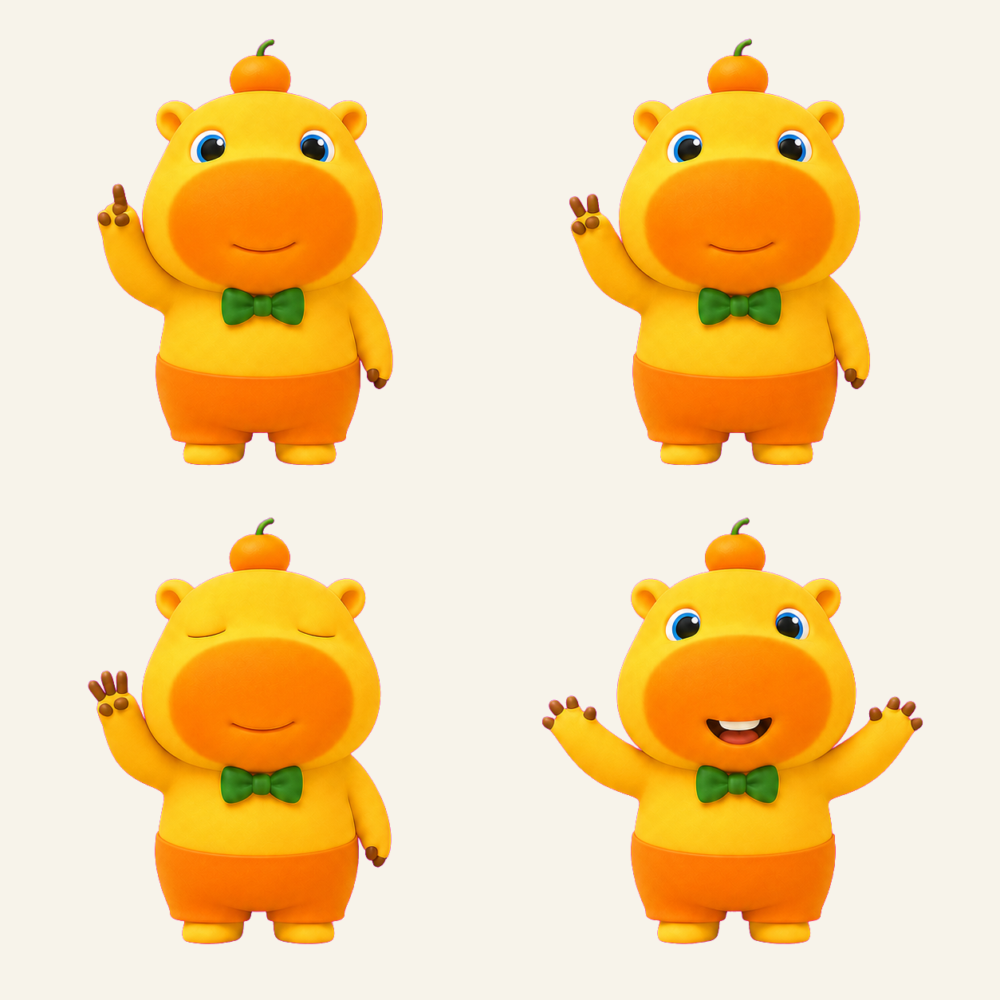
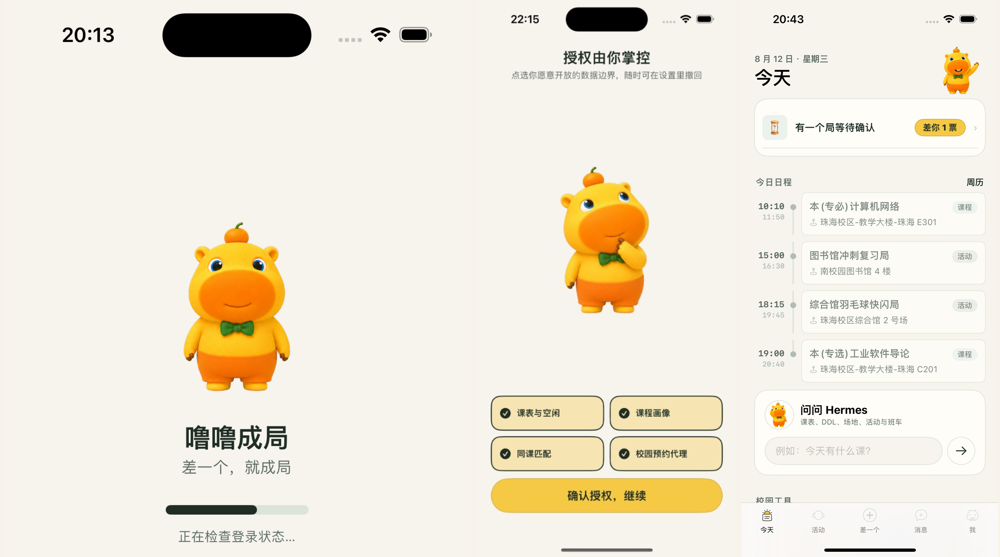
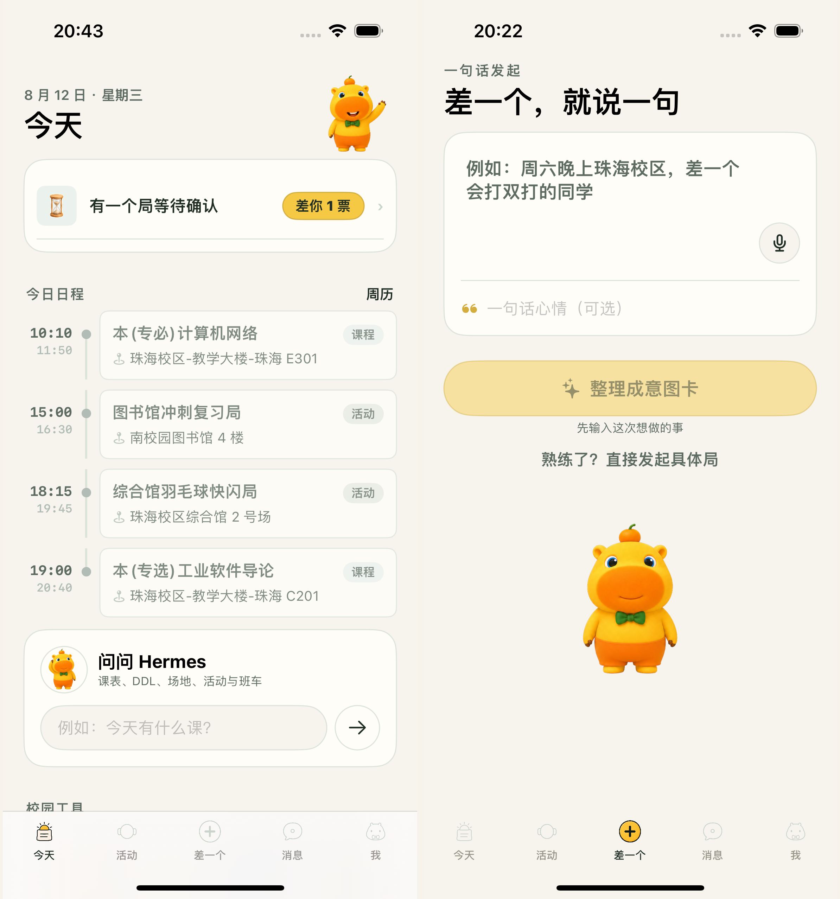
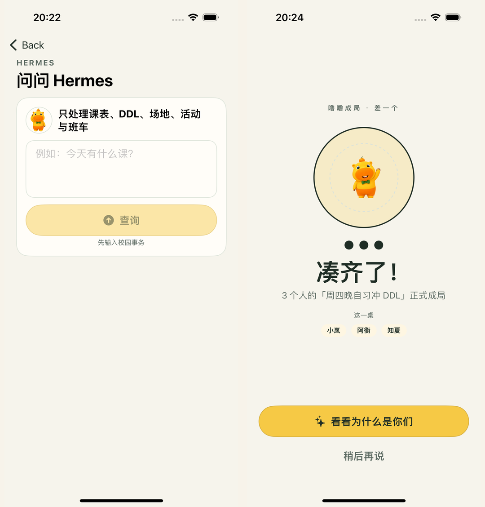
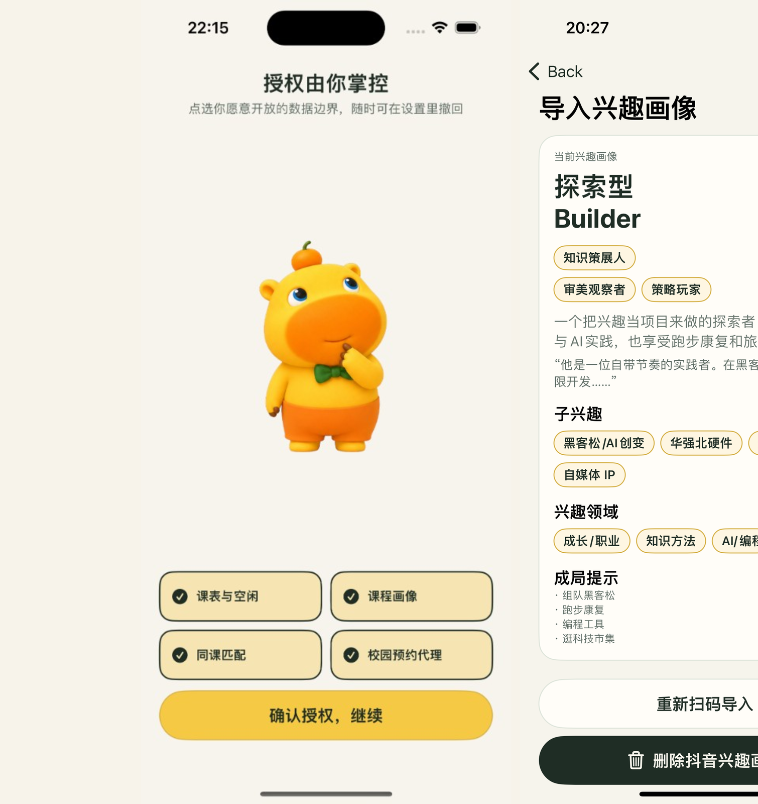
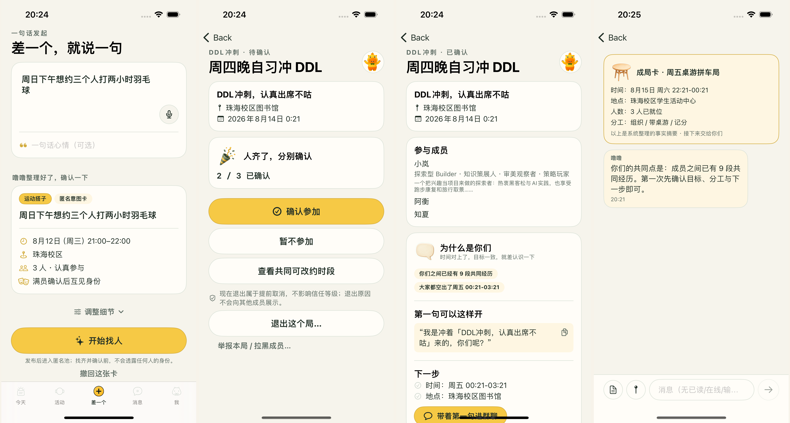
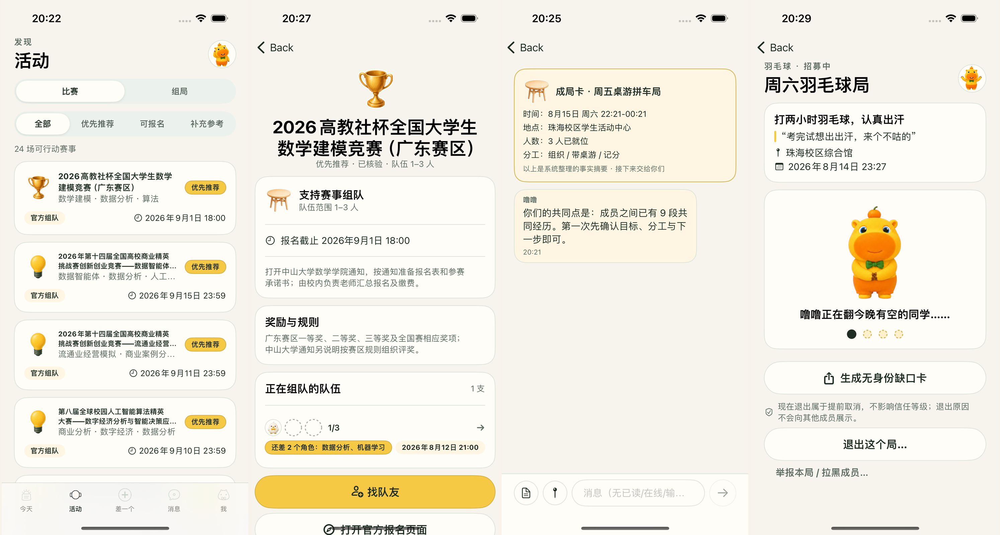

# Lulu Chengju · ONE MORE

<p align="center">
  <a href="./README.md">中文</a>
  ·
  <strong>English</strong>
</p>

<p align="center">
  
  &nbsp;&nbsp;
  
</p>

<p align="center">
  <b>One short. Then it is a gathering.</b><br/>
  AI does not introduce people. AI makes the thing happen.
</p>

<p align="center">
  Native iOS (SwiftUI · iOS 17+) + FastAPI + hermes campus action agent<br/>
  Plus a React web shell · deeply tuned for Sun Yat-sen University’s five campuses
</p>

<p align="center">
  <a href="https://hcnr0cwi1n15.feishu.cn/docx/HWhzdpMwAoWB3VxfypFc5Xz9nOg">Product brief (Feishu)</a>
  ·
  <a href="https://github.com/qybaihe/lulucampus">GitHub</a>
  ·
  <a href="https://luludrawu.classby.cn">Try the taste demo</a>
  ·
  <a href="docs/README.md">Engineering docs</a>
</p>

<p align="center">
  
</p>

<p align="center"><sub>You own every grant · hermes on Today · start with one sentence</sub></p>

---

## One-sentence definition

Lulu Chengju is an **AI gathering agent** that can execute real campus bookings after the user authorizes it.  
It combines a stated goal, real shared free slots from timetables, and past gathering history, quietly fills a table of the right people, books the room or court, writes the calendar, then steps aside.

The smallest product unit is not a person. It is a **gathering**: a competition team that still needs a frontend and a PM; a badminton session; a 90-minute homework sprint; walking to a talk together.

**In plain language, the system does two jobs:**

1. **Make campus ops feel like a cheat code** — timetable, assignment deadlines, gym vacancies, study rooms, career talks, inter-campus coaches: look up, book, and drop into Calendar in one sentence.
2. **Remove the awkward part of teaming and campus social** — you say “smart-app contest, I do backend, still need frontend and product”; Lulu complementary-matches the role gaps; only after the table is full does everyone confirm; the study room and calendar land together. Badminton, deadline sprints, and lecture buddies use the same loop. When the thing is done, the AI exits.

Campus social apps usually die trying to replace WeChat. This product does not airdrop a social square. People come to get campus work done; a group chat appears only after seats are filled. The entry is efficiency, the conversion is a full table, the residue is light collaboration.

---

## Dual-AI architecture

Two physically separate AIs, with opposite values. Merging them would collapse the product into “AI companionship.”

| | hermes · campus executor | Lulu · gathering matcher |
|---|---|---|
| Serves | one person | one gathering |
| Entry | always-on Today tab | center “one short” entry; fades after the gathering forms |
| Principle | use it more | use it less; leave when the job is done |
| Memory | no interpersonal memory | shared history exists, but never unsolicited recall |

<p align="center">
  
</p>

<p align="center"><sub>Left: hermes on Today · Right: “one short, say it in one sentence”</sub></p>

---

## Three skills

Lulu Chengju is an evolution of a campus AI assistant: first help you run campus life, then let you meet interesting people along the way.

### Skill 1 · SYSU Anything (campus action engine)

Connects SYSU systems to the agent: academic timetable and leave, Rain Classroom homework and check-in, library study rooms, sports venues, career-talk signup, research meetings, work-study and holiday leave, Qiguan / campus coaches, CAS session restore, Apple Calendar and Reminders. This is the base of the hermes execution path.

### Skill 2 · SSE AI orientation assistant

The School of Software Engineering’s official new-student Q&A: official guides plus 300+ student tips. Enrollment, courses, dorms, canteens, errands, transit — ask in one sentence, then follow up. Use it at [hello.classby.cn](https://hello.classby.cn). It is part of the campus-assistant base: you can get answers before you ever form a gathering.

### Skill 3 · Douyin interest persona

Scan a QR or paste a Douyin profile link → primary tag, sub-interests, a persona paragraph, and gathering hints. Visible to gathering members only after the table forms; one-tap delete. Cookies never appear in responses or logs.

Try it (paste a Douyin profile share link): **[luludrawu.classby.cn](https://luludrawu.classby.cn)**

<p align="center">
  
</p>

<p align="center"><sub>Judge landing on EdgeOne (`onemore-taste-edge/`)</sub></p>

### Demo highlight: persona meets electives

After a Douyin import, ask Hermes “recommend electives that fit me.” It calls `elective_match_taste`, ranks courses against the persona, and shows crowding. You can also ask “who else is taking this class”: only classmates who opted into social appear; one tap opens a two-person gathering channel (Hermes spark). NetID is never returned. Taste understands you; campus tools land the decision in the real catalog.

<p align="center">
  
</p>

<p align="center"><sub>Left: Ask Hermes · Right: the group chat opens only when the table is full</sub></p>

---

## You own every grant

Campus and social capabilities are off by default. Timetable, course persona, same-class matching, and campus booking proxy are **separate grants**. Each can be revoked in Settings, with derived data cascade-deleted. The boundary is what the user ticks, not what the system silently opens.

<p align="center">
  
</p>

<p align="center"><sub>Left: four optional grants · Right: Douyin persona, deletable in one tap</sub></p>

---

## Social: occasion first, group chat after the table is full

Competition teaming is the main scene. Badminton and deadline sprints are the daily high-frequency path. Campus events are the lightest first gathering. In every case: **no full table, no group chat.**

| Occasion | How it forms |
|---|---|
| Competition team | Complementary match on role gaps; T2 to enter the contest pool; team board shows anonymous seats and missing roles; study room + calendar land; official signup stays on the organizer site |
| Sports / deadline sprint | Shared free slots + full-table confirm; sports is the trust ladder; same-class sprints do not need campus-wide density |
| Event buddy | Career talks and lectures are discoverable without login — a good first gathering |

<p align="center">
  
</p>

<p align="center"><sub>Intent card → each person confirms → “why you” + first line → system gathering card in chat</sub></p>

<p align="center">
  
</p>

<p align="center"><sub>Contest radar · “still need N roles” · in-gathering chat · Lulu still recruiting</sub></p>

State machine: `Draft → Pooling → Tentative → Confirmed → Previewed → Executed → Active → Completed`  
(then Recurred or Archived. If the table never fills, it dissolves in silence. Failure is on the system.)

---

## Demo cast

A social product cannot be shown with one account. The repo ships six registered SYSU demo students with timetables, trust tiers, and gathering history. In development they go to class, post, and confirm in character — not every minute.

<p align="center">
  
</p>

<p align="center"><sub>Lin Yuan · Zhou Heng · Chen Kewei · Liang Jingxing · Su Wanning · He Yu</sub></p>

`u_demo_1`–`u_demo_6` are verified, granted, and social-enabled. Phone login: `13900001001`–`006`, password `cast-onemore`.

Two gatherings are left open for real testers; the cast will not sit those seats: (1) Saturday Yingdong badminton, one reliable player short; (2) MCM team, one modeler short (needs T2).

With `ONEMORE_CAST_DRIVER_ENABLED=true`, Celery beat ticks real APIs every 15 minutes. After a real tester speaks in gathering chat, one cast member may reply in a short line (`ONEMORE_CAST_REACTIVE_CHAT_ENABLED`, independent of the proactive driver). Manual tick:

```bash
uv run python -m onemore.scripts.tick_cast_driver
# or POST /internal/cast-driver/tick  (X-Admin-Token)
```

---

## Repository layout

```text
onemore/                 FastAPI service + Hermes action agent
  core/                  config, auth, idempotency, locks, HTTP
  hermes/                Action Schema, Vault, executor, Campus MCP, Agent sidecar
  modules/               identity / profile / schedule / intent /
                         matching / gathering / trust / collab /
                         competitions / actions / notify /
                         campus / taste_profile / media / cast_driver
  tasks/                 Celery worker + beat
ios/                     native SwiftUI client (XcodeGen)
web/                     React 19 shell (five tabs · 74 nodes)
onemore-edge-agent/      EdgeOne campus-agent sandbox (credentials stay on device)
onemore-taste-edge/      EdgeOne judge landing (luludrawu.classby.cn)
migrations/              Alembic
openapi/                 frontend contract
fixtures/                repeatable competition snapshots
data/                    SYSU campus reference pack
assets/ip/               Lulu IP + demo-cast avatars
docs/                    product and engineering docs (README screenshots)
tests/                   pytest
```

---

## Quick start

### Backend

```bash
uv sync --dev
cp .env.example .env
# fill ONEMORE_VAULT_MASTER_KEY / ONEMORE_TASTE_LLM_API_KEY as needed
uv run alembic upgrade head
uv run onemore-seed
uv run uvicorn onemore.main:app --reload
```

- Swagger: <http://127.0.0.1:8000/docs>
- OpenAPI: <http://127.0.0.1:8000/openapi.json>
- Ready: <http://127.0.0.1:8000/health/ready>

Local demo identity:

```http
X-User-ID: u_demo_1
# or
Authorization: Bearer dev:u_demo_1
```

Optional Hermes Agent sidecar (natural language such as elective matching via DeepSeek; keyword fallback):

```bash
uv run uvicorn onemore.hermes.agent_server:app --port 8642
# .env: ONEMORE_HERMES_AGENT_MODE=sidecar
```

### Docker

```bash
docker compose up --build
docker compose exec api uv run onemore-seed
```

Production compose is `docker-compose.prod.yml` (includes `hermes-agent`).

### iOS

```bash
cd ios
./Scripts/generate.sh
./Scripts/build.sh
./Scripts/test.sh
./Scripts/run.sh
```

Xcode 15+, iOS 17+ Simulator. Generated by XcodeGen. **No WKWebView.**

### Web

```bash
cd web && yarn && yarn dev
```

Phone frame on desktop, full-bleed on mobile. Same FastAPI and response contract as iOS. The public taste demo also lives at `web` `/demo/taste` or `onemore-taste-edge/`.

---

## Hermes modes

Default `ONEMORE_HERMES_MODE=fake`: full APIs and state machines, no campus systems.

Live:

```bash
ONEMORE_HERMES_MODE=real
ONEMORE_SYSU_CLI="$HOME/.local/bin/sysu-anything"
ONEMORE_VAULT_MASTER_KEY="$(openssl rand -hex 32)"
```

Deterministic path (the LLM never concatenates a shell command):

```text
natural language → LLM intent compile (structure only)
  → Action Schema allowlist / Campus MCP tools
  → seven checks (allowlist / params / grant / trust / all-confirm / idempotency)
  → argv translation (shell=False)
  → per-user serial lock · rate limit · circuit breaker
  → encrypted Vault mount
  → sysu-anything CLI
  → normalize result, destroy mount
```

Write-path rule: **preview → confirm → execute**. A client-sent `confirm=true` is discarded.

---

## Modules

| Module | What it does |
|---|---|
| `identity` | async scan sessions, identity facts, per-scope grants, revoke cascade |
| `profile` | course mapping, capability vectors, cross-major signals |
| `schedule` | timetable cache, free-slot ETL, privacy intersection, campus reachability |
| `intent` | typed intent compile, two-round clarify, anonymous publish / withdraw |
| `matching` | similar-buddy and complementary-team ranking, conflict checks |
| `gathering` | single state machine, multi-person confirm, reschedule, fill-in, recur, report |
| `trust` | T0–T4, unlocks, own progress, appeals |
| `collab` | in-gathering chat, relations, shared history, shared goals, AI exit |
| `competitions` | snapshot ingest, verification gate, team board, expiry |
| `actions` | preview snapshot, server-side confirm, idempotent execute, rollback |
| `notify` | transactional notices, categorized inbox, calendar DTO, merged chat push |
| `campus` | campus tools + elective–taste match + same-class / same-gym hints (Hermes / MCP only) |
| `taste_profile` | Douyin QR / share-link import, rule persona, optional LLM rewrite, public judge API |
| `cast_driver` | demo students walk the campus in character; short replies after a human speaks |

Also: T4 organizer console, block list, data export, account deletion.

---

## Completeness (frozen baseline 2026-08-12, then incremental)

This is not “almost done.” It is done. No mocks: every API, every screen, every row is real.

| Side | Evidence |
|---|---|
| Backend | 11+ modules · pytest green · mypy clean · OpenAPI 118 paths / 204 schemas · Alembic → 0019 |
| iOS | native SwiftUI · 74 formal nodes · 72 unit + 21 UI · 36 boards restored · zero major defects |
| Web | React 19 · five tabs / 74 nodes aligned with iOS · public taste demo |
| Data | contest radar: 24 human-verified events · SYSU pack v1.1 (5 campuses / 76 places / 137 venues) |

Poke the code: [github.com/qybaihe/lulucampus](https://github.com/qybaihe/lulucampus)

Longer product narrative:  
**[Lulu Chengju · ONE MORE product brief](https://hcnr0cwi1n15.feishu.cn/docx/HWhzdpMwAoWB3VxfypFc5Xz9nOg)** (Chinese)

---

## Tests

```bash
uv run ruff check onemore tests migrations
uv run mypy onemore
uv run pytest
```

Competition and campus reference data:

```bash
make competitions-validate && make competitions-ingest
make sysu-reference-build && make sysu-reference-validate
```

Workers:

```bash
uv run celery -A onemore.tasks.celery_app:celery_app worker -l INFO
uv run celery -A onemore.tasks.celery_app:celery_app beat -l INFO
```

---

## Product red lines (enforced in the server)

- `Enrollment` has no grade field
- Free-slot intersection DTOs have no `user_id`
- No route to query someone else’s trust tier
- No user search, friend request, or people-recommendation routes
- `SharedExperience` has no ratings, impressions, tags, or notes
- `Message` has no read receipts
- Pooling views never return signup counts or names
- Red-light campus actions have no ActionName and no CLI mapping
- Memory recall always requires intent / gathering / goal context
- No unsolicited recall from shared history

---

## Docs

| Doc | What |
|---|---|
| [README (中文)](README.md) | Chinese product + engineering README |
| [Feishu product brief](https://hcnr0cwi1n15.feishu.cn/docx/HWhzdpMwAoWB3VxfypFc5Xz9nOg) | Public product write-up |
| [docs/README.md](docs/README.md) | Engineering index |
| [ios/README.md](ios/README.md) | iOS delivery notes |
| [web/README.md](web/README.md) | Web shell notes |
| [onemore-taste-edge/README.md](onemore-taste-edge/README.md) | Judge taste landing on EdgeOne |

---

## Why this is hard to copy

- **No-form cold start** — Day-1 persona comes from the academic plan and enrollments, not self-reported tags
- **Real shared free slots** — timetable intersection; only the overlap is ever shown
- **Closed loop** — after everyone confirms, the booking hits campus systems
- **Silent gathering** — incomplete tables are invisible; failed pools dissolve without a trace
- **An AI that deletes itself** — success is human conversation, not time-on-app
- **You own every grant** — tick, revoke, cascade delete
- **Persona meets electives** — Douyin taste × real catalog crowding
- **Safety as architecture** — LLM never touches argv; red-light capabilities are unimplemented; vaults are per-user

---

## License

This repository is for product demo and defense. All rights reserved until a license is published.
