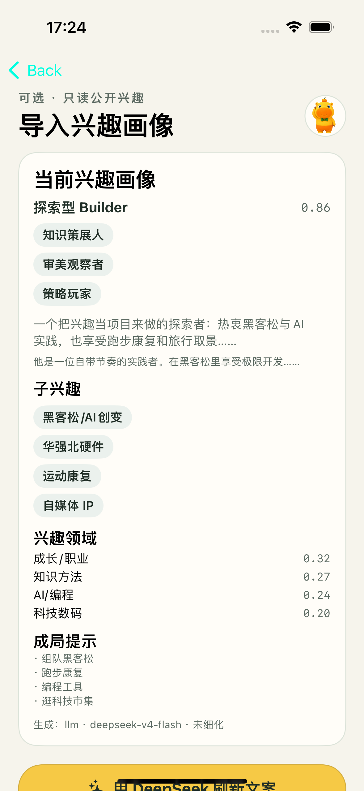
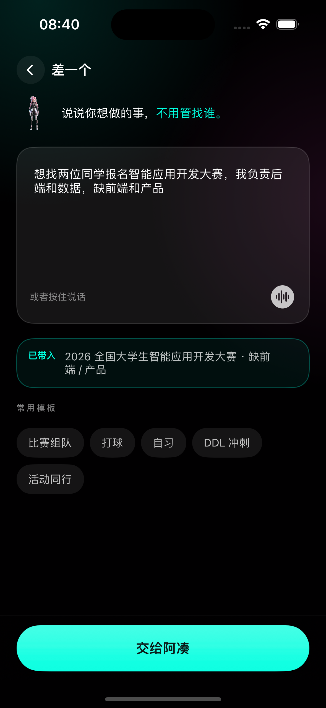
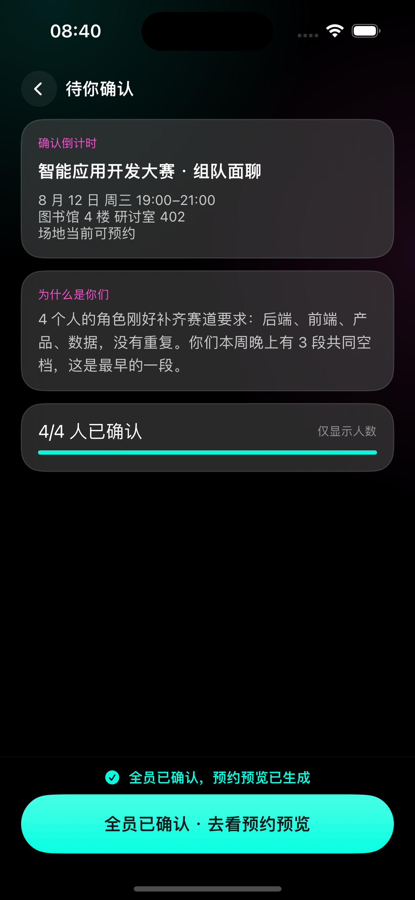
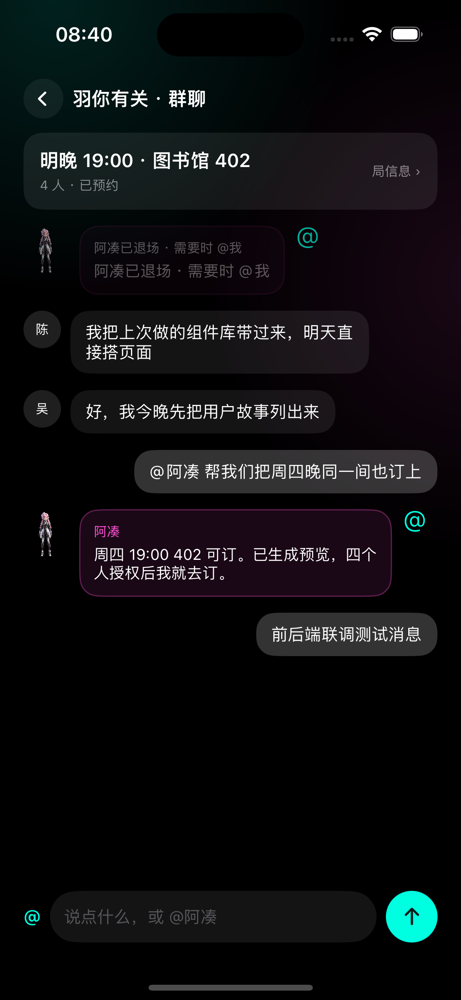
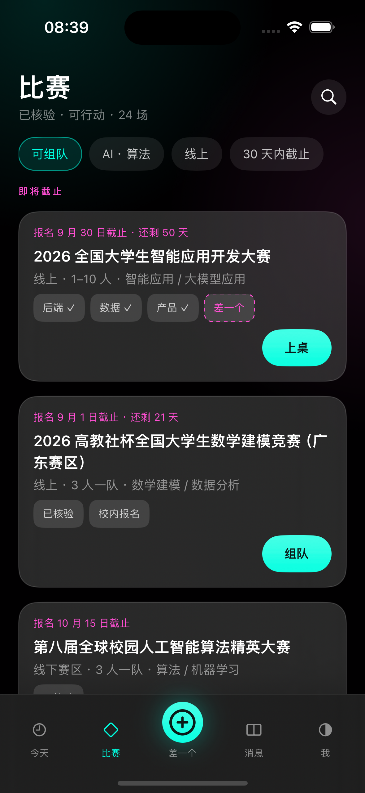

# 噜噜成局 · ONE MORE

<p align="center">
  
</p>

<p align="center">
  <b>差一个，就成局。</b><br/>
  AI 不介绍人，AI 促成事。
</p>

<p align="center">
  原生 iOS（SwiftUI · iOS 17+）＋ FastAPI 业务服务 ＋ hermes 校园行动代理<br/>
  另有 React Web 对齐端 · 已针对中山大学三校区五校园深度优化
</p>

<p align="center">
  <a href="https://hcnr0cwi1n15.feishu.cn/docx/HWhzdpMwAoWB3VxfypFc5Xz9nOg">产品说明文档（飞书）</a>
  ·
  <a href="https://github.com/qybaihe/lulucampus">GitHub</a>
  ·
  <a href="docs/README.md">工程文档索引</a>
</p>

---

## 一句话定义

噜噜成局是一个能在用户授权下执行真实校园预约的 **AI 成局智能体**。  
它把主动表达的目标、课表推导出的真实共同空档和历史成局记录组合起来，匿名凑齐合适的同伴，把场地、活动与日程真正落实，然后退到幕后。

最小产品单元不是「人」，而是「局」——一次羽毛球局、一次比赛筹备会、一次跨校区同行、一次 90 分钟作业冲刺，都是一个局。

<p align="center">
  
</p>

**说人话，这套系统干两件事：**

1. **效率像开了挂** — 课表、作业 DDL、体育馆空场、研讨室、宣讲会、岐关车，从查到订再到写进日历，一句话搞定。
2. **干掉社交最尴尬的部分** — 你只管说想干嘛，噜噜悄悄撮合；凑齐了才叫你确认，见面前把「为什么是你们」讲清楚，连开场白都替你发好。事儿成了，AI 退场。

---

## 双 AI 架构

产品内并存两个物理分离、价值观相反的 AI：

| 维度 | hermes · 校园执行 AI | 噜噜 · 成局撮合 AI |
|---|---|---|
| 定位 | 私有校园执行器，服务一个人 | 跨用户成局撮合者，服务一个局 |
| 入口 | 「今天」Tab 常驻 | 「⊕ 差一个」中央入口，成局后淡出 |
| 原则 | 用得越多越好 | 用得越少越好，办完就退场 |
| 记忆 | 不持有人际记忆 | 持有共同经历，但禁止主动召回 |

<p align="center">
  
</p>

<p align="center"><sub>左：开屏主张 · 右：校园身份认证</sub></p>

---

## 核心能力

### Skill 1 · SYSU Anything（校园行动引擎）

把中大校园系统接入 AI：教务课表与请假、雨课堂作业与签到、图书馆研讨室、体育场馆预约、宣讲会报名、组会、勤工助学、假期离返校、岐关车与校区班车、CAS 会话恢复，以及 Apple 日历 / 提醒事项同步。

### Skill 2 · 抖音兴趣画像

扫码导入「喜欢」列表 → 主标签 / 子兴趣 / 人格化描述 / 成局提示。默认仅成局后对成员可见，可一键删除。Cookie 不进响应与日志。

<p align="center">
  
</p>

### 成局主流程

`Draft → Pooling → Tentative → Confirmed → Previewed → Executed → Active → Completed`  
（之后可进入 Recurred 或 Archived；凑不齐静默解散，失败由系统承担。）

<p align="center">
  
</p>

<p align="center"><sub>意图输入 → AI 意图卡 → 「为什么是你们」 → 行动预览</sub></p>

| 截图 | 说明 |
|---|---|
|  | 「差一个」一句话发起 |
|  | 可解释匹配与分别确认 |
|  | 局内群聊 · AI 退场后的系统成局卡 |
|  | 比赛雷达 · 「还差 N 个角色」 |

---

## 仓库结构

```text
onemore/                 FastAPI 业务服务 + Hermes 行动代理
  core/                  配置、认证、幂等、锁、HTTP
  hermes/                Action Schema、Vault、执行器
  modules/               identity / profile / schedule / intent /
                         matching / gathering / trust / collab /
                         competitions / actions / notify /
                         campus / taste_profile / media
  tasks/                 Celery worker + beat
ios/                     原生 SwiftUI 客户端（XcodeGen）
web/                     React 19 对齐端（五 Tab · 74 节点）
onemore-edge-agent/      EdgeOne 编排沙箱（凭证留端）
migrations/              Alembic 迁移
openapi/                 前端契约 OpenAPI
fixtures/                赛事快照等可重复摄取数据
data/                    中大校园参考包、活动数据
assets/ip/               噜噜 / AIIA 动态 IP 资产
docs/                    产品与工程文档（含 README 配图）
tests/                   pytest 全量用例
```

---

## 快速启动

### 后端

```bash
uv sync --dev
cp .env.example .env
# 编辑 .env：按需填写 ONEMORE_VAULT_MASTER_KEY / ONEMORE_TASTE_LLM_API_KEY 等
uv run alembic upgrade head
uv run onemore-seed
uv run uvicorn onemore.main:app --reload
```

- Swagger：<http://127.0.0.1:8000/docs>
- OpenAPI：<http://127.0.0.1:8000/openapi.json>
- 就绪检查：<http://127.0.0.1:8000/health/ready>

本地演示身份：

```http
X-User-ID: u_demo_1
# 或
Authorization: Bearer dev:u_demo_1
```

`u_demo_1`–`u_demo_4` 均为已授权、开启社交的演示账号。

### Docker

```bash
docker compose up --build
docker compose exec api uv run onemore-seed
```

### iOS

```bash
cd ios
./Scripts/generate.sh
./Scripts/build.sh
./Scripts/test.sh
./Scripts/run.sh
```

要求：Xcode 15+、iOS 17+ Simulator。工程由 XcodeGen 生成，**不使用 WKWebView**。

### Web

```bash
cd web && yarn && yarn dev
```

PC 以手机框呈现，移动端全宽；与 iOS 共用同一 FastAPI 与响应契约。

---

## Hermes 模式

默认 `ONEMORE_HERMES_MODE=fake`，接口与状态机可完整联调而不触达校园系统。

真实联调：

```bash
ONEMORE_HERMES_MODE=real
ONEMORE_SYSU_CLI="$HOME/.local/bin/sysu-anything"
ONEMORE_VAULT_MASTER_KEY="$(openssl rand -hex 32)"
```

执行链路（确定性，LLM 不拼接命令）：

```text
自然语言 → LLM 意图编译（只产出结构）
  → Action Schema 白名单
  → 七道校验（白名单 / 参数 / 授权 / 信任 / 全员确认 / 幂等）
  → argv 转译（shell=False）
  → 用户级串行锁 · 限流 · 熔断
  → 加密 Vault 临时挂载
  → sysu-anything CLI
  → 结果归一化后销毁挂载
```

写操作铁律：**预览 → 确认 → 执行**；客户端传来的 `confirm=true` 一律丢弃。

---

## 业务模块

| 模块 | 能力 |
|---|---|
| `identity` | 异步扫码会话、身份事实、分项授权、撤回级联清除 |
| `profile` | 课程映射、能力向量、跨专业信号、自述标签 |
| `schedule` | 课表缓存、空档 ETL、隐私交集、校区可达性 |
| `intent` | 强类型意图编译、两轮澄清、匿名发布与撤回 |
| `matching` | 相似搭子与互补组队、共同经历加权、冲突校验 |
| `gathering` | 单入口状态机、多人确认、改约、补位、复局、举报 |
| `trust` | T0–T4 自动计算、统一解锁、自有进度、申诉 |
| `collab` | 局内群聊、搭子关系、共同经历、共同目标、AI 退场 |
| `competitions` | 原子快照摄取、核验闸门、去重、能力映射、过期下架 |
| `actions` | 预览快照、服务端确认、幂等执行、失败归一化、回滚 |
| `notify` | 事务通知、日历 DTO、群聊合并推送、提醒任务 |
| `campus` | 校园工具聚合（只经 Hermes 白名单） |
| `taste_profile` | 抖音兴趣导入、规则画像、可选 LLM 人格重述 |

附加：T4 主理人台、账号屏蔽、数据导出与注销闭环。

---

## 完成度（冻结基线 · 2026-08-12）

**不是接近完成，是全部完成。** 全程不用一个 Mock——每个接口、每一屏、每条数据都是真的。

| 侧 | 证据 |
|---|---|
| 后端 | 11+ 业务模块 · pytest 全绿 · mypy 零错误 · OpenAPI 118 paths / 204 schemas · Alembic → 0019 |
| iOS | 原生 SwiftUI · 74 正式节点 · 72 unit + 21 UI · 36 画板还原 · major 缺陷为零 |
| Web | React 19 · 五 Tab / 74 节点与 iOS 对齐 |
| 数据 | 比赛雷达 24 条人工核验赛事 · 中大参考包 v1.1（5 校区 / 76 地点 / 137 场馆） |

也欢迎来拷打代码：[github.com/qybaihe/lulucampus](https://github.com/qybaihe/lulucampus)

更完整的产品叙事、赛题对应、创新点与延展路线，见飞书文档：  
**[噜噜成局 · ONE MORE 产品说明文档](https://hcnr0cwi1n15.feishu.cn/docx/HWhzdpMwAoWB3VxfypFc5Xz9nOg)**

---

## 测试与检查

```bash
uv run ruff check onemore tests migrations
uv run mypy onemore
uv run pytest
```

赛事与校园参考数据：

```bash
make competitions-validate && make competitions-ingest
make sysu-reference-build && make sysu-reference-validate
```

后台任务：

```bash
uv run celery -A onemore.tasks.celery_app:celery_app worker -l INFO
uv run celery -A onemore.tasks.celery_app:celery_app beat -l INFO
```

---

## 产品红线（服务端强制）

- `Enrollment` 不含成绩字段
- 空档交集 DTO 不含 `user_id`
- 没有查询他人信任等级的路由
- 没有用户搜索、好友申请或关系推荐路由
- `SharedExperience` 不含评价 / 印象 / 标签 / 备注
- `Message` 不含已读字段
- Pooling 视图不返回报名人数或报名者
- 红灯校园动作没有 ActionName，也没有 CLI 映射
- 记忆召回必须携带 intent / gathering / goal 上下文
- 不存在基于共同经历的主动召回通知

---

## 文档

| 文档 | 说明 |
|---|---|
| [飞书 · 产品说明](https://hcnr0cwi1n15.feishu.cn/docx/HWhzdpMwAoWB3VxfypFc5Xz9nOg) | 对外产品文档（含配图） |
| [docs/README.md](docs/README.md) | 工程文档索引 |
| [docs/00_产品方案_V2.1.md](docs/00_产品方案_V2.1.md) | V2.1 产品方案 |
| [docs/01_iOS客户端开发指南.md](docs/01_iOS客户端开发指南.md) | iOS 开发指南 |
| [docs/02_后端服务开发指南.md](docs/02_后端服务开发指南.md) | 后端开发指南 |
| [docs/03_行动代理与Hermes设计.md](docs/03_行动代理与Hermes设计.md) | Hermes 设计 |
| [ios/README.md](ios/README.md) | iOS 交付说明 |
| [web/README.md](web/README.md) | Web 对齐端说明 |

---

## 创新点（摘要）

- **零填表冷启动** — Day 1 画像来自培养方案与选课，不是自述标签  
- **真实共同空档** — 课表交集计算，只输出交集  
- **执行闭环** — 多人确认后预约落到校园系统  
- **静默成局** — 未满员不可见，凑不齐静默解散  
- **把自己删掉的 AI** — 成局后退场，优化「事成」而非停留时长  
- **安全即架构** — LLM 不碰命令行；红灯能力不可达；凭证按人加密隔离  

---

## License

本仓库用于产品演示与答辩；未单独声明许可证前，保留所有权利。
