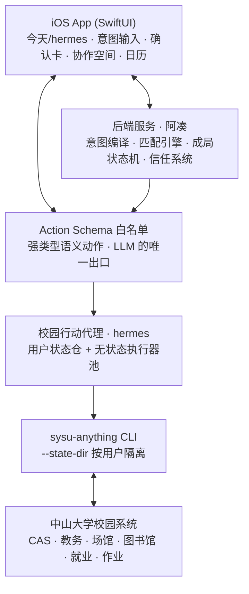
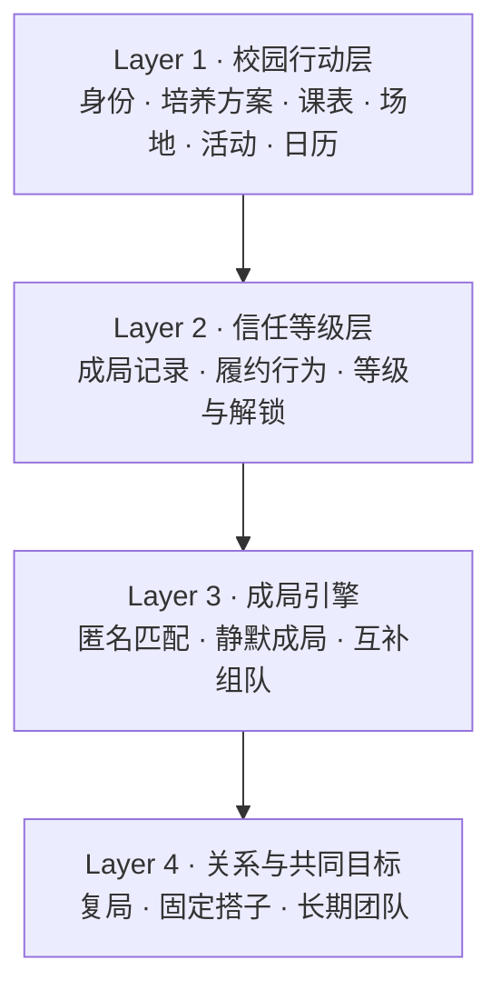
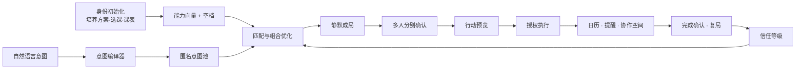

# 噜噜成局（工程代号 ONE MORE）
## 中山大学校园成局智能体 · 功能规格与开发方案 V2.1

> 产品：噜噜成局
> 智能体：噜噜
> 核心主张：**AI 不介绍人，AI 促成事。**
> Slogan：差一个，就成局。
> 适用范围：中山大学（三校区五校园）
> 技术形态：iOS App + 后端服务 + 校园行动代理（hermes）

---

# 版本变更与架构决议 · V2.1

> V2.0 是产品定义，V2.1 在其上落定六条架构决议。**决议优先于正文**：正文中与本节冲突处，以本节为准（已就地修订的段落标注 `[V2.1]`）。

## 决议一 · hermes 与阿凑是两个 AI，物理分离

| | **hermes** | **阿凑** |
|---|---|---|
| 定位 | 你私有的校园执行器 | 跨用户的成局撮合者 |
| 所在层 | Layer 1 校园行动层 | Layer 3 成局引擎 |
| 服务对象 | 一个人 | 一个局 |
| 产品原则 | **用得越多越好**（它是工具） | **用得越少越好**（F20 退场协议） |
| 客户端位置 | 「今天」Tab 常驻 | 「⊕ 差一个」入口，成局后淡出 |

**为什么必须分开**：一个 AI 无法同时满足"天天被使用"和"完成后主动消失"两条相反要求。合并即退化为 0.4 明确反对的 AI 陪伴产品。分开后两条价值观各自自洽——**一个拼命干活，一个干完就走**。

## 决议二 · hermes 的形态是「一份状态 + 无状态执行器」

"每人一个 hermes"是**产品语义，不是部署形态**。绝不做成每人一个常驻进程。

```
用户感知                    实际部署
──────────────            ──────────────────────────────────
"我的 hermes"       →      每用户：持久化的 凭证 + 状态 + 画像缓存
                           全局：  无状态执行器池，按需拉起、用完即弃
```

底层复用已建成的本地 CLI `sysu-anything`，其 `--state-dir <dir>` 参数天然支持按用户隔离状态，**多租户不需要改 CLI 核心**。详见《03_行动代理与Hermes设计》。

## 决议三 · LLM 不拼命令行，中间必须有 Action Schema 白名单

```
自然语言 → [LLM] → Action Schema（强类型/枚举/白名单） → [确定性代码] → CLI 调用
                            ↑ 唯一的收窄点
```

**理由**：命令行拼接是注入面；LLM 输出不可复现、不可审计；且 LLM 一旦自主附加 `--confirm` 即构成越权真实预约。

这是 F7「LLM 只做意图编译与理由生成，不做匹配打分」原则向执行层的延伸：**LLM 不碰执行**。至此 LLM 在全系统只有两个出口——意图编译（F6）、理由生成（F9）。

## 决议四 · `--confirm` 的使用权绑定在多人确认协议上

CLI 的写操作默认只预览、显式 `--confirm` 才提交，与 F10 三段式天然同构，直接复用：

| CLI 行为 | 成局状态机 |
|---|---|
| 不带 `--confirm`，返回 payload 快照 | `Previewed`（快照存 `CampusAction.预览快照`） |
| 服务端校验「全员确认完成」后才放行 `--confirm` | `Executed` |

**`--confirm` 是全系统的安全总闸，掌握在服务端的业务条件里，任何 agent 无权自行附加。**

## 决议五 · 行动能力三档分级，红灯项在架构上不可达

CLI 能做的 ≠ 产品该做的。行动代理只暴露**与成局相关的最小能力集**：

| 档 | 策略 | 能力 |
|---|---|---|
| 🟢 绿灯 | 读操作，可自动执行 | 课表、节次、今日课程、研讨室空档、场馆空档、作业 DDL、班车、宣讲会/招聘会列表与详情 |
| 🟡 黄灯 | 写操作，需多人确认 + 用户授权 | 研讨室预约、场馆预约、组会预约 |
| 🔴 红灯 | **适配器层直接切断，永不代理** | 请假、简历投递、勤工助学报名、长假离返校、选课、成绩、支付 |

红灯清单在 F27 中作为架构约束固化。

## 决议六 · 课表是基础设施，走 ETL + 缓存，不现查

课表被 F8（共同空档）、F2（学业节律）、F4（同课同学的教学班粒度）三处依赖，是全系统最底层的数据资产。

```
授权那一刻   → 全学期一次性扫描 → 结构化落库
日常展示     → 走缓存
每周一次     → 增量校验（调课、补课、退改选）
今日视图     → 仅此场景走实时查询
```

**同时这也是规模化前提**：执行器每次调用都要拉起进程并打校园系统，高频读路径必须由缓存承接。

## 决议七 · 对话开放给人，不开放给 AI；关系只能靠共同经历产生

V2.0 定义了「成局后 24h 内达到最低人际互动阈值」这条指标，却没有提供人际互动的通道——这是一处真实缺口。V2.1 补上，并同时补上防止它长成社交广场的约束。

**三条通道，三种策略**

| 通道 | 策略 |
|---|---|
| 人 ↔ 人 | **开放**（F28）。阿凑退场就是为了把位置让出来 |
| 人 ↔ 阿凑 | **克制**（F20 不变）。成局后退场，只在提醒/改约/补位/被 @ 时出现 |
| 陌生人私聊 | **不存在** |

**三条防退化约束**

1. **没有好友申请，没有加好友按钮**——关系只能通过一起完成一件事产生（F28）
2. **共同经历账本只记事实，不记评价**——记录"做过什么"，绝不记录"这个人怎么样"（F29）
3. **记忆只降低已有意图的摩擦，不制造没有的意图**——禁止一切基于记忆的主动召回（F30）

> 这三条加起来，使「对话 + 记忆」成为判断二（关系靠共同经历建立）的产品化，而不是滑向 0.4 反对的社交广场。

## 决议八 · 外部数据源采用「快照摄取」而非实时爬取

赛事库（F31）等外部数据源的采集，是需要判断与人工介入的流程——社交线索必须回原文核验，未核验条目占比很高。这类流程**不适合做成服务内的定时爬虫**。

```
外部采集流程（定期运行，含核验与去重）→ 产出结构化快照
                                          ↓
系统摄取管道（定时任务）→ 核验闸门 → 字段映射 → 去重 → 落库
```

**责任分离**：采集负责"找到并核实"，摄取负责"清洗并映射"。产品侧永远不直接接触未核验数据。

> 同一原则适用于未来任何外部信息源：**产品消费的是已核验的快照，不是原始网络。**

## 附带修订

- **F1 认证方式**：由「WKWebView 承载 CAS 登录页输密码」改为**企业微信扫码**，客户端永不接触密码。
- **F11 能力清单**：补入 `matrix`（作业 DDL/提交记录）与 `usc`（BPM 预约）两个已建成但 V2.0 未收录的能力。
- **冷启动**：宣讲会/招聘会的列表与详情**无需任何登录**，可在用户尚未授权、匿名池尚空时即填充「公开局」，作为 F23 组织者供给的兜底库存。

---

# 第一部分 · 产品定义

## 0.1 一句话

**AI 不介绍人，AI 促成事。**

噜噜成局是一个能真正执行校园预约的 AI 成局智能体：它把你的目标、你的真实空档和你的课程背景组合起来，匿名凑齐合适的同伴，并把场地、活动和日程真正落实下来。

## 0.2 产品单元

产品的最小单元不是“人”，是**局**——一件需要几个人才能发生的事。

一次羽毛球、一次比赛筹备会、一次两小时的作业冲刺、一个持续四周的共同目标。

## 0.3 三条产品判断

**判断一：学生缺的不是可认识的人，是自然开口的理由和不丢面子的退出机制。**

AI 的价值不是多推荐几个人，是承担社交里高摩擦的部分——表达需求、匿名试探、协调时间、凑齐人数、执行预约、处理失败。

**判断二：关系不是靠匹配建立的，是靠共同经历建立的。**

“你们都喜欢音乐”只能产生一个话题，“你们周四一起完成了一次排练”才可能产生关系。

**判断三：AI 应当是媒介，不是社交对象。**

阿凑在成局前积极，在成局后克制。成局后主动退出日常对话，只保留提醒、改约、补位。

## 0.4 产品不是什么 `[V2.1 已精确化]`

- 不是一个继续刷人的校园社交广场——**有对话，但没有陌生人聊天入口，也没有加好友按钮**
- 不是以聊天时长为目标的 AI 陪伴产品——**人可以尽情聊，但阿凑成局后就退场**
- 不是推荐完联系人就结束、后续仍由用户自己协调的匹配工具
- 不是公开展示个人评分的校园评价系统——**共同经历只记事实，不记评价**

> V2.1 补入了人际对话（F28）与共同经历账本（F29）。判断标准没有变：
> **我们优化"事情有没有办成""对话有没有发生"，永远不优化"用了多久"。**

## 0.5 最终产出

> **一群原本不认识或不熟悉的人，在共同目标下完成确认、完成预约、真实成局。**

---

# 第二部分 · 为什么只做中山大学

这一节需要主动讲，不能等着被问。

## 1.1 校园社交产品必须是单校的

社交产品的死因永远是密度不足，不是功能不够。跨校在这个品类里是伪需求——你没法跟外校的人周四晚上一起打球，也没法跟外校的人组一支要频繁碰面的参赛队。

**产品的天然边界就是校园本身。**

一个在所有学校都能跑的方案，必然在每所学校都浅：它拿不到课表、拿不到研讨室、拿不到培养方案，只能退回到让用户自己填标签。而那恰恰是我们判断中最不可信的数据源。

**深度绑定一所学校不是妥协，是这个品类唯一正确的起手式。**

## 1.2 中山大学是一个足够大的“单校”

- 三校区五校园，横跨广州、珠海、深圳三座城市
- 六万余名在校生，体量超过很多产品的全量规模
- 跨校区带来的真实协作痛点（异地组队、跨校区课程），是全国多数高校没有的复杂度

**在中大跑通，意味着模型在最复杂的单校环境下被验证过。**

## 1.3 可复制性的答案在架构里

评委一定会问“怎么扩展到别的学校”。答案不能是“我们再谈几个学校”，要落在架构上：

```
学校无关（可直接复用）        学校相关（需要重写）
────────────────────         ────────────────────
意图编译器                    统一身份适配
匹配引擎                      教务系统适配（培养方案、选课）
共同空档计算                  场馆预约系统适配
成局状态机                    图书馆研讨室适配
多人确认协议                  校内活动信息源适配
信任等级系统                  ─────────────────
补位与容错                    仅此一层，约 6–8 个接口
协作空间与退场协议
人际对话与共同经历账本
赛事信息库  ← V2.1
iOS 客户端全部
```

**移植到新学校 = 写一个新的行动适配器，不是重做产品。**

> `[V2.1 修订]` **赛事信息库从「学校相关」移入「学校无关」**——黑客松与创新大赛绝大多数是全国性的，与学校无关。
> **队伍是同校的，比赛是全国的**（见 F31）。这使学校相关层进一步收窄。

---

# 第三部分 · 系统总览

## 2.1 技术架构 `[V2.1]`



- **iOS App**：唯一客户端。承担 hermes 工具面、意图输入、确认交互、协作空间、系统日历写入、推送。
- **后端服务（阿凑）**：全部业务逻辑。匹配、成局判定、信任计算、定时任务。
- **Action Schema 白名单**：所有校园动作的唯一入口。强类型、枚举化，LLM 只能产出此层的结构，不能产出命令。
- **校园行动代理（hermes）**：独立部署。由「每用户持久化状态仓」+「全局无状态执行器池」两部分组成，对上只暴露查询/预览/执行三类语义接口，对下调用 CLI 适配各校园系统。

> **两条分离是关键设计**：
> ① **凭证分离**——业务层永远拿不到校园凭证本体，只能调用语义动作接口。
> ② **能力分离**——hermes 服务个人、阿凑服务局，两者通过 Action Schema 通信而非共享状态。
>
> 这既是安全设计，也是 1.3 中"移植只需重写适配器"的实现基础。

## 2.2 产品四层



**信任漏斗的机制化表述（这是“为什么羽毛球和比赛能在同一个产品里”的硬答案）：**

> 比赛组队需要 T2 等级，而 T2 只能通过完成低风险的日常局获得。
> **低风险局是高风险局的准入前提**——这不是叙事，是产品规则。

## 2.3 主数据流



---

# 第四部分 · 功能规格

## 模块 A · 身份与冷启动初始化

这一模块解决产品的头号难题：**第一天没有历史数据时，凭什么匹配得准。**

答案是——我们不靠历史，靠学籍。

---

### F1 · 统一身份认证 `[V2.1 已修订认证方式]`

**功能描述**

用户通过**企业微信扫码**完成中山大学统一身份认证，验证真实学生身份，并授权后续的校园数据读取与代理执行。

**输入**

- 企业微信扫码确认（**客户端与服务端全程不接触 NetID 密码**）

**输出**

- 用户唯一标识
- 认证事实字段：学院、专业、年级、校区
- 校园会话凭证（写入该用户在 hermes 中的独立状态仓，业务层不可读）

**核心规则**

- 认证事实字段（学院/专业/年级/校区）**不可由用户编辑**——这是我们相对所有社交产品的信任基线。
- 认证与社交是两件事：认证通过不等于进入社交池，社交需要用户单独开启（见 F19）。
- 授权范围分项呈现、可单独撤回：课表、培养方案、选课记录、代理预约。

**为什么改用扫码**（V2.1 决议）

- 产品全链路不出现密码输入框，安全边界比 WebView 方案干净得多，与 F27 一致。
- 底层 CLI 的既有认证链路即为企业微信扫码，无需另建密码通道。

**开发要点**

- 扫码是**交互式阻塞流程**（生成二维码 → 等待扫描确认 → 回收会话，默认 180s 超时），**不能塞进一次 HTTP 请求**，必须由服务端的异步登录编排器承接：拉起执行器 → 取二维码 → 推送至 App → 用户扫码 → 落库会话 → 通知客户端。
- 会话失效需优雅降级：不阻断浏览与匹配，仅在执行动作时提示重新扫码授权。
- 会话健康度需定时巡检并提前提示，不要等到用户点"确认预约"时才失败。

---

### F2 · 培养方案与选课记录初始化

**功能描述**

认证成功后，系统读取用户的培养方案与已修/在修课程，一次性生成初始画像。用户无需填写任何表单即可进入匹配。

**输入**

- 培养方案（专业、方向、课程结构）
- 已修课程列表（课程名、课程号、学分、课程类型：必修/限选/任选/通识）
- 在修课程列表（含教学班、上课时间地点）

**输出**

| 派生资产 | 内容 | 用途 |
|---|---|---|
| **学科域向量** | 计算机 / 设计 / 商科 / 传播 / 生医 等多维分布 | 互补组队 |
| **能力标签** | 由课程映射的技能标签，用户可编辑增删 | 互补组队 |
| **课程社群** | 在修课程 → 同课同学池 | 破冰理由、冷启动（见 F4） |
| **学业节律** | 课表 → 每周可用时间窗 | 共同空档计算（见 F8） |
| **主动性信号** | 跨专业选修识别 | 能力可信度加权（见 F3） |

**核心规则**

- **只使用“修过什么”，不使用“修得怎么样”。** 即使成绩可读取，也不进入任何画像或匹配逻辑。这既是伦理边界，也避免产品退化为绩点排序器。
- 能力标签对用户可见可编辑，但系统会区分标注来源：`已验证（选课记录）` / `自述`。
- 匹配时两者权重不同，自述标签权重显著低于已验证标签。

**为什么这一条重要**

所有校园社交产品的初始画像都来自用户自填，也就是“我希望别人怎么看我”。培养方案和选课记录是学校记录的、不可自我美化的事实。

> **我们的冷启动画像不是用户声称的，是学校记录的。**

**开发要点**

- 需要维护一张 `课程号 → 学科域 + 能力标签` 的映射表。首版可用规则 + LLM 辅助批量标注，人工校验高频课程。
- 课程类型字段必须完整抓取，F3 完全依赖它。

---

### F3 · 跨专业选修信号

**功能描述**

识别用户主动选修的、超出本专业培养方案范围的课程，作为能力画像中的高权重信号。

**判定逻辑**

```
跨专业选修 = 课程学科域 ≠ 主修学科域
           ∧ 课程类型 ∈ {任选, 跨院系选修, 辅修}
           ∧ 课程 ∉ 本专业培养方案必修集合
```

**为什么它是最强信号**

一个计算机专业的学生**主动**选了《视觉传达设计》，和一个设计专业学生**被培养方案安排**修了同一门课，在数据上是同一条记录，在意义上完全不同：

| | 信号含义 | 权重 |
|---|---|---|
| 本专业必修 | 学过 | 基础 |
| 本专业限选 | 学过，有一定选择 | 中 |
| **跨专业任选** | **主动投入时间去学的、专业外的东西** | **高** |

**主动选择是兴趣与投入意愿的证据，被动安排不是。** 这一条在互补组队里价值极高——一支队伍最需要的不是“简历上有这个技能的人”，是“真的想干这件事的人”。

**输出**

- `cross_major_score`：跨域主动性得分
- `interest_domains`：由跨专业选修反推的兴趣域，独立于主修域

**用途**

- 互补组队：能力向量中跨专业选修项加权
- 跨院系匹配：主动跨域的人更可能接受跨院系队伍
- 破冰理由生成：“TA 是化学专业的，但选修过三门交互设计课”

**开发要点**

- 需要培养方案的必修集合作为基准，这是判定的前提，务必抓全。
- 辅修/双学位应单独识别，权重高于普通任选。

---

### F4 · 同课同学连接

**功能描述**

基于在修课程的教学班，为用户提供“同课同学”这一层天然的连接语料。

**为什么这是被低估的一张牌**

匿名意图池在冷启动期是空的——需要 N 个人在同一时间窗内独立发出兼容意图，这个事件的初期发生概率很低。

**但同课同学池天生就是满的。** 每个用户注册当天，就自动拥有几十到几百个“有天然共同点的人”。而且“我们这学期同上《机器学习》”是校园里最自然、最不需要解释的破冰理由，它不依赖任何社交池密度。

**使用场景**

| 场景 | 用法 |
|---|---|
| DDL 冲刺局 | 同课同学最容易凑成，作业相同、时间压力相同 |
| 课程项目组队 | 天然的组队边界，需求真实存在 |
| 破冰理由 | 成局后展示“你们同上 X 课”，第一句话不用尬聊 |
| 匹配加权 | 同课作为相似度的一个加分项 |

**隐私规则（这一条必须严格执行）**

- **不提供同课同学名单**，任何时候都不能出现“谁和你一起上这门课”的浏览页。
- 同课关系只作为**匹配语料**存在于服务端，只有在双向成局后，才在协作空间显示“你们同上《XXX》”。
- 用户可关闭“允许基于我的课程进行匹配”。

> 同课同学池是匹配的燃料，不是通讯录。这个边界一旦模糊，产品就变成了课程班级的偷窥工具。

**开发要点**

- 教学班（而非课程）才是正确的粒度——同一门课不同教学班的学生互不相识。
- 大课（几百人）的同课信号强度要衰减，小班和实验课信号强度加权。

---

## 模块 B · 意图与匹配

### F5 · 场景化“差一个”入口

**功能描述**

产品不以空白社交广场为入口。用户在使用校园工具的真实节点上，被询问是否需要同伴。

**触发点设计**

| 用户正在做什么 | 触发文案 |
|---|---|
| 查询羽毛球/篮球场 | 这个时段有场，还差一起打的人吗？ |
| 预约研讨室 | 房间最多 4 人，要不要凑一支讨论小组？ |
| 查看比赛/课题信息 | 你是缺队友，还是想找同行报名的人？ |
| 浏览赛事库（F31） | 这个比赛下周报名截止，要组队吗？还差 3 个人 |
| 查看作业 DDL | 今晚开一个 90 分钟冲刺局吗？ |
| 报名宣讲会/讲座 | 已有同学准备会后一起复盘，要加入吗？ |
| 查看组会/课题组 | 要不要找同方向的人一起去？ |

**核心逻辑**

用户为办事而来，社交是自然出现的第二步。我们不需要说服任何人下载一个“交朋友 App”。

**开发要点**

- 触发需要节制：同一场景在 N 天内不重复触发；用户明确忽略两次后停止该场景触发。
- 触发文案由 LLM 结合当前上下文生成，但需要有兜底模板。

---

### F6 · AI 意图卡

**功能描述**

用户说一句自然语言，AI 编译为结构化的、可匹配的意图卡。用户逐项确认或修改。

**意图卡结构**

```yaml
局类型: 比赛组队              # 搭子局 / 组队局 / 目标局
目标: 参加 XX 创新应用大赛
我的能力:                     # F2/F3 预填，可编辑
  - 后端开发 [已验证·选课]
  - 模型调用 [自述]
需要角色:                     # 组队局必填
  - 前端
  - 产品
  - 视觉设计
目标强度: 认真完赛，有机会争奖   # 影响匹配同层
可用时间: 周二晚 / 周六下午     # F8 预填，可编辑
校区: 珠海校区
人数: 4 人
社交模式: 满员后再公开身份
截止: 3 天后自动结束
```

**核心规则**

- **能力项由 F2/F3 预填**，用户只需删改，不需要从零填写。这是我们相对所有“填表式”匹配产品的体验落差。
- **可用时间由 F8 预填**，用户只需勾选，不需要回忆课表。
- 每个字段都标注来源（已验证/自述/AI 推断），用户随时可改。

**开发要点**

- 意图编译由 LLM 完成，但输出必须是严格 schema，不接受自由文本。
- 需记录“用户修改了哪些字段”，作为意图编译准确率的核心指标。

---

### F7 · 双模式匹配引擎

**这是产品最核心的算法模块，两种模式的优化目标是相反的。**

> **同好靠相似连接，同伴靠互补连接。AI 必须能分清这两件事。**

#### 模式一 · 搭子匹配（求相似）

适用：运动、自习、活动同行、DDL 冲刺

```
Score = Σ wᵢ · fᵢ(A, B)
```

| 维度 | 权重 | 说明 |
|---|---:|---|
| 时间重合度 | 30% | 共同空档的时长与稳定性 |
| 目标一致度 | 25% | 同一件事 + 相近的投入强度 |
| 地点便利性 | 15% | 同校区 / 步行可达 |
| 水平或强度相近 | 15% | 运动水平、学习强度自述 |
| 互动偏好相容 | 10% | 话多话少、是否想认识新朋友 |
| 信任等级同层 | 5% | 见模块 D |

**关键判断：时间重合权重最高。**

所有搭子产品都死在“兴趣对得上、时间对不上”。我们有真实课表，这是我们能给出的、别人给不出的第一优势。

#### 模式二 · 组队匹配（求互补）

适用：比赛、科研项目、课程作业组

```
maximize:  技能覆盖度 × α
         + 目标一致度 × β
         + 共同时间充足度 × γ
         + 跨专业主动性 × δ
subject to: 队伍人数 = N
           必需角色全覆盖
           共同时间 ≥ 每周 T 小时
           所有成员校区可达
           所有成员信任等级 ≥ T2
```

**核心逻辑：你不需要第二个你。** 一支四个后端的队伍必死。算法要在“目标一致”的约束下，找**能力差异最大**的组合。

**技能覆盖度的计算** `[V2.1 已补齐数据来源]`

- 能力向量来自 F2（选课映射）+ F3（跨专业加权）+ 用户自述（低权重）
- 覆盖度 = 队伍能力并集 / 该赛事所需能力全集
- **「该赛事所需能力全集」来自 F31 赛事库**（赛道、任务描述、适合方向），队伍人数约束来自赛事的组队规则
- 缺口角色明确标注，直接驱动“还差一个前端”的文案

> **前提条件**：赛事所需能力与用户能力向量必须落在**同一套标签体系**里（即 F2 的课程能力标签空间），否则覆盖度无法计算。这是 F31 摄取管道的核心约束。

**开发要点**

- 这是组合优化问题，不是两两推荐。首版可用贪心 + 局部搜索，池子大了再上更好的求解。
- **不要用 LLM 做匹配打分**——不可复现、不可解释、不可调优。LLM 只用于两件事：意图编译（F6）、匹配理由生成（F9）。

---

### F8 · 共同空档计算

**功能描述**

在不暴露任何人原始课表的前提下，计算一组人的共同可用时间窗。

**输入**

- 各成员课表（服务端持有，不下发给其他用户）
- 各成员已确认的其他局
- 各成员手动标记的不可用时间

**输出**

- 共同可行时段列表，按时长与稳定性排序
- 每个时段标注可行人数

**核心规则**

- **对外只输出交集，不输出任何个人的原始日程。** 用户永远看不到“某某周三下午有课”。
- 计算需考虑校区通勤时间：跨校区的相邻时段不可用。
- 结果与场地可用性联合计算（见 F11），避免推荐“人有空但没场”的时段。

**开发要点**

- 区间求交是简单算法，难点在校区通勤矩阵与“稳定性”定义（是偶尔有空还是每周稳定有空）。
- 稳定性是长期搭子匹配的关键变量，需要单独建模。

---

## 模块 C · 成局与执行

### F9 · 静默成局

**功能描述**

局由 AI 发起、AI 承担失败。用户全程不承担“发起人”的社交风险。

**四条核心规则**

1. **未满员前，报名情况对所有人不可见**——包括其他报名者。
2. **满员后才互相公开**，且需各自确认。
3. **未满员自动静默解散**——没有人知道你想去过，也没有人否定过你。
4. **解散是系统行为，不是被谁拒绝**——界面文案永远不出现“某某拒绝了你”。

**状态机**

```
Draft        意图草稿
  ↓
Pooling      匿名招募中
  ↓
Tentative    达到最低人数，等待各自确认
  ↓
Confirmed    确认达标
  ↓
Previewed    行动预览生成
  ↓
Executed     预约/报名真实成功
  ↓
Active       局进行中
  ↓
Completed    完成
  ↓
Recurred / Archived
```

**异常分支**

| 分支 | 处理 |
|---|---|
| 人数不足 | 静默解散，意图可自动顺延至相邻时段 |
| 成员拒绝 | 回到候选池，不向任何人显示拒绝者 |
| 场地失效 | 自动计算下一组可行时段，重新预览 |
| 临时退出 | 启动补位（F13） |
| 多次失联 | 信任等级降级（模块 D），不做公开惩罚 |
| 举报/拉黑 | 立即切断双方未来匹配链路，永久 |

**匹配理由生成**

成局时，AI 必须回答“为什么是你们”。这段理由本身就是最好的破冰材料：

> “你负责后端，另外三位分别覆盖前端、产品和视觉。你们四个人都选择了‘认真完赛’，每周二晚和周六下午都有空。其中两位和你同上过《人工智能》。”

**开发要点**

- 成局判定是定时任务，需要幂等和并发锁——同一个用户不能被同时锁进两个冲突的局。
- 静默解散不发失败通知，或只发极弱的中性通知（“这次没凑齐，已为你留意周六下午”）。

---

### F10 · 多人确认协议

**功能描述**

所有真实的校园动作，都必须在全体成员分别确认后才执行。

**确认卡**

```
比赛第一次碰面
────────────────
时间：周六 14:00–16:00
地点：珠海校区 图书馆 A1302
成员：4 人（满员）
研讨室状态：可预约
已确认 3/4
[确认参加]  [提议改时间]  [退出本局]
```

**执行规则**

| 动作类型 | 执行方式 |
|---|---|
| 团体预约（研讨室） | 全员确认后，由发起人的授权代理提交，含全部成员信息 |
| 个人报名（讲座、赛事） | 每人在自己账号下分别确认与提交 |
| 系统不支持代办 | 降级为一键跳转官方入口，但保留成局与协调能力 |

- **预约成功后才写入日历**，避免产生无效日程。
- 任一成员在确认阶段退出 → 回到 Tentative，启动补位。
- 确认有超时时间，超时视为放弃，但不计入爽约。

**开发要点**

- “预览 → 授权 → 执行”三段式必须严格，不允许任何跳过预览的自动执行。
- 执行失败要有完整回滚：已写入的日历、已发出的通知都要撤回。

---

### F11 · 校园行动执行

**功能描述**

行动代理对接中大各校园系统，提供统一的查询/预览/执行语义。

**能力清单** `[V2.1 已按实际 CLI 能力校准并分级]`

| 系统 | 档 | 查询 | 预览 | 执行 | 在产品中的作用 |
|---|:---:|:---:|:---:|:---:|---|
| 统一身份（企业微信扫码） | 🟢 | ✓ | — | — | 身份基线 |
| 教务（培养方案/选课/课表/节次） | 🟢 | ✓ | — | — | 画像初始化、共同空档 |
| 今日课程 | 🟢 | ✓ | — | — | 今日视图 |
| 作业与 DDL（含提交记录） | 🟢 | ✓ | — | — | **冲刺局触发源** |
| 图书馆研讨室 | 🟡 | ✓ | ✓ | ✓ | **组队局最强闭环**，支持带成员的团体预约 |
| 体育场馆 | 🟡 | ✓ | ✓ | ✓ | 运动搭子闭环 |
| 组会 / 课题 | 🟡 | ✓ | ✓ | ✓ | 科研连接 |
| 宣讲会 / 招聘会 | 🟢 | ✓ | ✓ | **✗** | 求职同行；**列表与详情免登录** |
| 校内班车 / 跨校区岐关车 | 🟢 | ✓ | ✓ | 入口 | 跨校区局的行程协调 |
| 请假 / 简历投递 / 勤工助学 | 🔴 | — | — | — | **架构上不可达，见 F27** |

> **一个被低估的冷启动杠杆**：宣讲会与招聘会的列表、详情**不需要任何用户凭证**。这是全系统唯一的零凭证数据源——可以在用户尚未授权、匿名池尚空时就填满「公开局」，直接缓解冷启动空池问题。

**对外表述口径**

不说“拿到了系统写权限”，说：

> **已验证从信息查询、空档发现、操作预览到用户授权提交的完整执行闭环。**

**开发要点**

- 适配器统一接口签名，为 1.3 的可移植性服务。
- 每个动作都需要幂等键，防止重复预约。
- 校园系统限流与维护窗口要有熔断和排队。

---

### F12 · 日历与提醒同步

**功能描述**

预约成功后，通过 EventKit 写入用户系统日历，并配置提醒。

**规则**

- 仅在 `Executed` 状态后写入。
- 事件包含：时间、地点、成员数、协作空间深链。
- 改约、取消需同步更新或删除日历事件。
- 用户可关闭日历写入，仅保留 App 内推送。

---

### F13 · 补位与容错

**功能描述**

“差一个”主动作不只负责第一次凑人，也负责局发生变化后的修复；它继续承担产品核心机制，而不是 App 总品牌。

**触发与处理**

| 情况 | 处理 |
|---|---|
| 成员退出 | 缺口自动回到匿名候选池，优先通知曾报名但未成局的人 |
| 补位者加入 | 只看到必要信息，不回溯此前的协作记录 |
| 无法补齐 | 给出降级方案：双打改练球、4 人会议改 3 人、线下改线上 |
| 场地失效 | 自动寻找相邻时段或同类资源，重新走确认流程 |
| 组队局关键节点前人员风险 | 提前预警发起人，主动询问是否需要补位 |

**开发要点**

- 补位候选池需要保留“曾报名未成局”的人，这是最高质量的补位来源。
- 降级方案需要针对局类型预置规则，不要让 LLM 自由发挥。

---

## 模块 D · 信任等级系统

**这是本版最重要的新增模块。它一次性解决四件事：**

1. 把“信任漏斗”从叙事变成产品规则
2. 回答“为什么羽毛球和比赛组队在同一个产品里”
3. 把高风险功能（2 人局、线下、组队）挡在门槛之后，构成安全设计
4. 提供正向激励，且不引入公开评分的伦理问题

设计参考 Discourse 的信任等级机制（Linux.do 等社区采用），并针对线下场景做了关键改造。

---

### F14 · 等级定义与晋级

| 等级 | 名称 | 获得方式 |
|---|---|---|
| **T0** | 访客 | 已下载，未完成 CAS 认证 |
| **T1** | 已认证同学 | 完成 CAS 认证 + 画像初始化 |
| **T2** | 靠谱同学 | 完成 3 次有效成局 · 准时确认率 ≥ 80% · 近 30 天无临期爽约 · 无有效举报 |
| **T3** | 组局者 | 完成 10 次有效成局 · 其中 ≥ 3 次由本人发起 · 复局 ≥ 2 次 · 爽约率 < 10% |
| **T4** | 校园主理人 | 组织者认证（社团、赛事方、学生组织），或 T3 + 邀请 |

**晋级原则（照抄 Discourse 最值得抄的部分）**

- **完全自动**：不需要申请，不需要审核，达标即升。
- **完全透明**：用户随时能看到自己距离下一级还差什么，进度可视化。
- **解锁的是能力，不是身份**：等级不是荣誉勋章，是功能开关。

---

### F15 · 等级解锁能力表

| 能力 | T1 | T2 | T3 | T4 |
|---|:---:|:---:|:---:|:---:|
| 浏览公开局 | ✓ | ✓ | ✓ | ✓ |
| 创建意图卡 | ✓ | ✓ | ✓ | ✓ |
| 加入 3 人及以上的局 | ✓ | ✓ | ✓ | ✓ |
| 同课同学破冰局 | ✓ | ✓ | ✓ | ✓ |
| DDL 冲刺局 | ✓ | ✓ | ✓ | ✓ |
| **进入比赛/项目组队池** | — | ✓ | ✓ | ✓ |
| **自行发起局** | — | ✓ | ✓ | ✓ |
| **2 人局** | — | ✓ | ✓ | ✓ |
| **跨院系匹配** | — | ✓ | ✓ | ✓ |
| **AI 代理预约执行** | — | ✓ | ✓ | ✓ |
| **创建长期共同目标** | — | — | ✓ | ✓ |
| **创建周期性固定局** | — | — | ✓ | ✓ |
| **组织 6 人以上的局** | — | — | ✓ | ✓ |
| **补位快速通道** | — | — | ✓ | ✓ |
| **创建官方局 / 批量名额** | — | — | — | ✓ |
| **活动管理台** | — | — | — | ✓ |

**这张表就是信任漏斗的产品化形态：**

> 你想组一支参赛队 → 需要 T2 → T2 需要 3 次有效成局 → 最容易完成的 3 次成局就是打球、自习、冲刺。
>
> **低风险局不是可有可无的附属场景，它是高风险局的唯一入口。**

---

### F16 · 降级与恢复

**这是 Discourse 机制里最容易被忽略、但对我们最关键的一半。** 只升不降的等级系统会迅速失去意义。

| 触发条件 | 处理 |
|---|---|
| 近 30 天临期爽约 ≥ 2 次 | 自动降一级，进入 30 天观察期 |
| 近 30 天临期退出率 > 25% | 自动降一级 |
| 收到有效举报 | 立即降至 T1，冻结全部高承诺场景 |
| 观察期内行为达标 | 自动恢复原等级 |

**原则**

- 降级**只影响匹配与解锁**，不产生任何公开标记，不通知其他用户。
- 降级必须**告知本人 + 说明原因 + 提供申诉入口**。
- 恢复路径必须存在且清晰，不做永久性惩罚（举报除外）。

---

### F17 · 可见性规则

**这是我们对 Discourse 机制的关键改造，必须严格执行。**

Discourse 的等级是公开的，因为那是纯线上论坛。**我们涉及线下见面，公开等级会立即产生阶层感、羞辱效应和社交压力。**

| 对象 | 可见性 |
|---|---|
| 自己的等级与进度 | ✅ 完整可见，含距下一级的具体差距 |
| **他人的等级** | ❌ **任何情况下都不可见** |
| 局的准入门槛 | ✅ 可见（“本局要求 T2 及以上”） |
| 成员的具体等级 | ❌ 不可见 |
| 任何形式的排行榜 | ❌ 不存在 |

用户能感知到的只有一句话：

> “本次为你优先匹配了确认习惯与你接近的同学。”

**这样既保留了激励与安全价值，又完全避开了“校园信用分”的伦理雷区。**

---

### F18 · 信任事件与计算

**记录的行为事件**

| 事件 | 影响 |
|---|---|
| 按时确认 | + |
| 提前 ≥ 24h 取消 | 中性（不惩罚合理取消） |
| 临期（< 2h）退出 | − − |
| 确认后未出现 | − − − |
| 预约真实执行成功 | + |
| 局后完成确认 | + |
| 与原成员复局 | + + （最强正信号） |
| 收到有效举报 | 立即降级 |

**关键设计**

- **提前取消不惩罚。** 惩罚提前取消会导致用户干脆不取消、直接不出现，反而更糟。要惩罚的是“临期”和“失联”。
- **复局是最强的正向信号**，权重高于任何单次履约——它同时证明了履约和关系质量。
- 到场验证在拿到校方签到/核销数据之前，以“预约成功 + 局后完成确认 + 复局”三者作为行为代理。

---

## 模块 E · 协作与退场

### F19 · 轻协作空间

**功能描述**

成局后生成临时空间，只提供完成这件事所必需的信息。

**包含** `[V2.1 已补入人际对话]`

- 集合时间、地点、路线
- AI 生成的一条开场信息（基于真实共同点，不是尬聊模板）
- **局内群聊**——成员之间的真实对话通道（见 F28）
- 第一次会议议程 / 活动规则
- 角色与待办
- 改约、补位、取消入口
- 必要提醒

**不包含**

- 朋友圈式的动态流
- 个人主页
- 陌生人聊天入口
- 任何鼓励持续刷的设计

**生命周期**

- 单次局：结束后 7 天归档；**归档只收起协作信息，对话与共同经历保留**（见 F29）
- 目标局：目标周期结束后归档
- 用户可主动把这段关系保留为搭子关系（进入 F29 / F21）

---

### F20 · AI 退场协议

**功能描述**

阿凑在成局后主动降低存在感。这是产品最重要的价值观表达。

**退场话术**

> “你们四个人的共同空档是周六下午，A1302 已经预约成功。
> 第一次会议建议先确认赛题和分工。
> 剩下的交给你们，我在需要改约或补位的时候再出现。”

**退场后阿凑只做四件事**

1. 时间提醒
2. 改约协调
3. 成员变动时的补位
4. 被 @ 时的工具调用（订场、查资料、加日程）

**明确不做**

- 主动发起闲聊
- 定期“关心”用户
- 制造话题维持活跃度
- 任何形式的人格养成

**退场协议约束的是谁** `[V2.1 关键澄清]`

| 对话类型 | 策略 |
|---|---|
| **人 ↔ 人** | **完全开放**。这是产品的目的，阿凑退场正是为了把位置让出来（见 F28） |
| **人 ↔ 阿凑** | **严格克制**。成局后退场，只在上述四种情况出现 |
| **hermes ↔ 个人** | 不受本协议约束。hermes 是私人工具，不进入任何群聊 |

> 退场协议约束的从来不是"对话"，是"**AI 占据对话**"。
> 没有人际对话通道，本节的衡量指标根本无法达成——**人际互动是退场成功的证据，不是它的对立面。**

**衡量方式**

```
AI 退场成功率 =
  成局后 24h 内达到最低人际互动阈值
  且无需 AI 二次促聊的局数
  / 有效成局数
```

> **这是全场唯一一个“AI 使用量越低越好”的指标。**

---

### F21 · 复局与共同目标

**功能描述**

一次局结束后，给参与者三个明确选项：

- **原班复局**——一键重开，AI 直接找下一个共同空档
- **保留部分成员，再差一个**——回到匹配池补人
- **结束**——不再推荐，双方都不会知道

**共同目标（长周期形态）**

示例：

- 四周累计跑步 100 公里
- 六周完成参赛作品
- 连续三周固定羽毛球
- 考前完成五次自习冲刺

AI 在其中的角色：**自动记账、自动播报进度、在谁快掉队时提醒其他人拉一把。**

它不替代成员之间的交流，它是那根把人绑在一起的绳。

**开发要点**

- 目标进度尽可能由行为数据自动更新（预约记录、到场记录），减少手动打卡。
- 掉队提醒发给**其他成员**而非掉队者本人——社会压力比系统提醒有效得多，但要注意措辞不能羞辱。

---

### F28 · 人际对话 `[V2.1 新增]`

**功能描述**

为已成局的成员之间提供真实的对话通道。

**为什么这不违背产品主张**

F20 的衡量指标是「成局后 24h 内达到最低人际互动阈值」——**这条指标要求人必须能对话**。V2.0 定义了指标却没有提供通道，是一处真实缺口。

> 我们反对的从来不是对话，是**AI 占据对话**，和**在陌生人之间无限刷人**。
> 阿凑退场，正是为了把对话的位置让给人。

**对话的三个层级**

| 层级 | 范围 | 生命周期 |
|---|---|---|
| **局内群聊** | 一个局的全体成员 | 随局创建，归档后转入搭子关系 |
| **搭子对话** | 共同完成过局的人之间 | 长期，直到任一方解除关系 |
| **陌生人私聊** | **不存在** | — |

**核心规则（决定这个功能会不会长成社交广场）**

1. **没有好友申请，没有加好友按钮。** 关系**只能**通过一起完成一件事产生——这是判断二的字面产品化：关系是挣来的，不是加来的。
2. **对话在满员确认后开启**，不在匿名招募期开启。未成局的人之间永远没有通道。
3. **不存在陌生人搜索**——不能按姓名、学号、专业找人并发起对话。
4. **不做已读回执、在线状态、正在输入**——这些是制造焦虑与在线时长的设计。
5. **单方面可解除关系**，解除后双方不再有通道，且**对方不会收到任何通知**（与 F21「结束」一致）。
6. 举报与拉黑常驻可见（F26）。

**明确不做**

- 动态流 / 朋友圈 / 状态更新
- 陌生人聊天广场、匹配即聊
- 群聊扩列（拉人进群、群二维码）
- 表情包商店、虚拟礼物等一切提升停留时长的机制

**衡量方式**

不看消息总量，看 **「成局后 24h 内产生过双向对话的局占比」**——这是 F20 退场成功率的直接输入。

> 我们优化的是**对话是否发生**，不是**对话有多长**。

---

### F29 · 共同经历账本 `[V2.1 新增]`

**功能描述**

系统自动记录一组人共同完成过什么事，形成搭子关系的事实底稿。

> **判断二说"关系是靠共同经历建立的"。这个模块就是把那句判断变成一张真实存在的表。**

**核心设计：零手动，全自动**

账本的每一条都是成局状态机的副产品，用户**不需要做任何记录动作**。这就是与既有流程"无缝结合"的含义——

```
局流转到 Completed
   ↓ 自动写入
共同经历账本：谁、和谁、什么类型、什么时候、什么结果
   ↓ 自动供给
复局建议 · 破冰材料 · 匹配加权 · 共同目标进度
```

**记录什么**

| 字段 | 示例 |
|---|---|
| 参与者 | 你 + 另外 3 人 |
| 局类型 | 比赛组队 / 羽毛球 / 健身 / DDL 冲刺 |
| 次数与时间 | 累计 4 次，最近一次 3 周前 |
| 结果 | 完成 / 中断 |
| 共同点 | 同上《人工智能》、都跨专业选修过设计课 |
| 长期目标进度 | 六周参赛作品，已完成 4 周 |

**绝不记录什么（这条是伦理红线）**

- 对人的**评价**（"这个人靠谱/话多/迟到"）
- 印象标签、性格描述
- 任何可被解读为私下评分的内容

> 账本记录的是**事实**（做过什么），不是**判断**（这个人怎么样）。
> 一旦记录判断，它就变成了 F17 明确禁止的私下评分系统。

**用途**

| 用途 | 说明 |
|---|---|
| **复局** | F21 一键原班复局的数据基础 |
| **破冰材料升级** | 第一次是"你们同上《人工智能》"，第四次是"你们一起完成过 3 次冲刺局" |
| **匹配加权** | 有共同经历的人再次匹配时显著加权（F18：复局是最强正信号） |
| **共同目标** | F21 长周期目标的进度底稿 |
| **信任计算** | 复局事件的判定依据 |

**可见性规则**

- 只有**共同参与过的人**能看到这段共同经历，且**双方看到的内容一致**
- 不可跨关系聚合——**不存在"我的搭子排行榜"、"最常一起的人"这类页面**
- 用户可删除某段关系记忆（等同 F21 的「结束」）
- 删除后对方无感知

**开发要点**

- 账本按「关系」建索引而非按「人」，避免退化成通讯录
- 一次局同时写入所有成员两两之间的关系，需要保证一致性
- 归档局时协作信息收起，但账本条目保留

---

### F30 · 阿凑的记忆调用协议 `[V2.1 新增]`

**功能描述**

规定阿凑在什么时候可以调用共同经历账本，什么时候不可以。

**这一条存在的意义**

有了记忆的 AI 最容易滑向两件产品明确反对的事：**主动召回**和**制造话题**。所以记忆必须配一份调用纪律。

**允许调用的三个时机（全部是被动的）**

| 时机 | 表现 |
|---|---|
| **用户已经产生相关意图时** | 用户说"想打球" → "上次和你打球的三位，其中两位周四也有空" |
| **新局成局时生成破冰材料** | "你们四个人一起完成过 2 次冲刺局" |
| **共同目标进度播报时** | "六周计划已完成 4 周" |

**禁止调用的场景**

- ❌ 主动推送"你们好久没一起打球了"
- ❌ 定期生成"本月回顾""你和 XX 的一年"
- ❌ 任何以提升活跃度为目的的记忆唤起
- ❌ 在用户没有表达任何意图时提及某个人

**判断标准（唯一一条）**

> **记忆用于降低用户已有意图的摩擦，不用于制造用户没有的意图。**
>
> 用户想打球时告诉他"上次那几个人也有空"——这是帮忙。
> 用户没想打球时提醒他"好久没打球了"——这是召回，是我们明确反对的东西。

**与 hermes 的边界**

hermes **不持有任何人际记忆**。它只服务个人事务（课表、场地、DDL），不知道用户有哪些搭子。人际记忆完全属于阿凑。

---

## 模块 F · 传播与冷启动

### F22 · 可分享缺口卡

**功能描述**

把匿名缺口卡分享到班群、社团群、比赛群、朋友圈。

```
还差 1 个前端
────────────────
目标：XX 创新应用大赛
时间：每周二晚、周六下午
校区：珠海
状态：3/4
身份：双方确认后公开
[ 我来 ]
```

**核心价值**

中大的班群、社团群、赛事群里已经有现成的高密度关系网络。**缺口卡直接借用这些网络的分发能力，不需要我们从零重建社交图谱。**

**规则**

- 分享者不必公开完整个人信息
- 接收者可以先匿名加入，走同样的静默成局流程
- 卡片有效期与局的截止时间一致，过期自动失效

---

### F23 · 组织者供给

**功能描述**

T4 主理人（社团、赛事方、学生组织）可创建带明确时间与人数的官方局。

**作用**

解决“新用户第一次打开时池子是空的”这个致命体验问题。**组织者供给是匿名池的初始库存。**

**能力**

- 创建官方局，含固定时间、地点、人数
- 批量导入名额
- 活动管理台：查看报名、成局、到场情况
- 局模板：周期性活动一键复制

---

### F31 · 赛事信息库与定期摄取 `[V2.1 新增]`

**功能描述**

维护一个经核验的赛事库（黑客松、创新大赛、学科竞赛），由外部采集流程定期产出快照，系统定期摄取。

**它补上了方案的两个真实缺口**

| 缺口 | 补法 |
|---|---|
| **"发现"环节缺失** | 意图输入（F6）默认用户已经知道要参加什么比赛。实际上大多数人不知道有什么比赛可打——赛事库补上这一环 |
| **F7 缺少"所需能力全集"** | F7 写"覆盖度 = 队伍能力并集 / 该赛事所需能力全集"，但从未定义该集合的来源。赛事的赛道与任务描述正是它 |

**数据来源与形态**

采集由独立的赛事采集流程完成（跨官网、公众号、聚合平台，含去重与证据核验），**产出结构化快照文件**；产品侧只负责摄取。

> **关键形态判断：不做实时爬虫。**
> 采集是需要判断与人工介入的流程（社交线索需回原文核验），不适合做成服务内的定时爬虫。
> 正确形态是：**外部流程定期产出快照 → 系统摄取快照。** 采集与摄取责任分离。

**摄取管道**

```
赛事采集流程（定期运行，产出快照）
   ↓
摄取管道（定时任务）
   ↓ ① 核验闸门  ② 字段映射  ③ 去重  ④ 过期下架
CompetitionEvent 表
   ↓
公开局库存 · 意图预填 · 组队匹配输入 · 场景触发 · 截止提醒
```

**① 核验闸门（必须严格）**

采集结果天然包含大量未核验线索。**只有核验状态为「可行动」的条目才可进入产品**；未核验线索一律不展示。

> 用户看到一个不存在的比赛，比看不到比赛的伤害大得多。

**② 字段映射**

| 赛事字段 | 映射到 | 服务的功能 |
|---|---|---|
| 赛道 / 任务描述 / 适合方向 | **所需能力全集** | **F7 技能覆盖度计算** |
| 组队规则 | 队伍人数约束 | F7 约束项 |
| 报名截止 / 提交截止 | 意图卡截止、提醒 | F6 F12 |
| 线上线下 / 城市 | 校区可达性约束 | F7 F8 |
| 赛程（初赛/复赛/决赛） | 长期目标里程碑 | F21 共同目标 |
| 奖励 | 展示 | — |
| 报名链接 | **跳转官方入口** | 见下方规则 |

> **关键约束**：赛道到能力标签的映射，必须复用 F2 中「课程 → 能力标签」的**同一套标签体系**。
> 只有赛事所需能力与用户能力向量落在同一标签空间，覆盖度才算得出来。这是整条链路能否闭合的技术前提。

**③ 报名不代办**

赛事报名是个人重大决策，属于 F27 红灯范围。**产品只提供"跳转官方报名入口"，绝不代理提交。** 我们负责的是把队伍凑齐，不是替你报名。

**与"只做中山大学"的关系**

这里不存在矛盾，而且是加强：

> **队伍是同校的，比赛是全国的。**

单校约束来自「需要频繁线下碰面」，这只约束队友，不约束赛事本身。中大学生组一支同校队伍去打全国比赛，正是最典型的场景。

**对可移植性的增强** `[修订 1.3]`

赛事库是**学校无关**资产。移植到新学校时**直接复用，无需重建**——这使 1.3 中"学校相关层"进一步收窄。

**冷启动价值**

赛事库与宣讲会数据一样零凭证，可在用户未授权时展示。但它比宣讲会更适合本产品：

> **团队赛天然需要组队；个人赛天然适合找备赛搭子，宣讲会不具备这种持续协作结构。**
> 每一条赛事都可以成为一个等待被凑齐的协作局，但不得把个人赛伪装成正式参赛队。

**开发要点**

- 摄取需幂等，按赛事唯一标识去重（同一赛事可能来自多个来源）
- 过期赛事自动下架，但保留历史用于"追踪下一期"
- 赛道映射表首版可规则 + LLM 辅助，高频赛事人工校验
- 摄取失败不可影响线上数据，采用先落暂存表再切换

---

## 模块 G · 隐私与安全

### F24 · 五条产品硬约束

1. **社交默认关闭**——使用校园查询与预约功能，不代表进入社交池。
2. **不存在实时在场者视图**——任何时候都不提供“现在谁在图书馆/健身房”。
3. **双向确认前身份最小化**——先展示匹配理由与必要条件，后展示身份。
4. **原始日程永不公开**——只输出交集，不输出任何人的课表。
5. **信任等级不公开**——只用于匹配侧分层与功能解锁。

### F25 · 场景敏感度分级

| 场景 | 社交策略 |
|---|---|
| 图书馆自习区 | **禁言空间**，只在到场前组队、结束后复盘，不提供现场连接 |
| 健身房器械区 | 同上。“被观察”本身就是许多用户尤其女生的焦虑源 |
| 球类场地 | 社交主场，可全流程 |
| 研讨室 | 社交主场，天然的协作空间 |
| 赛事与活动 | 社交主场 |

**核心设计：把接触时刻挪到“前”和“后”。**

不在图书馆里社交，在图书馆门口社交。

### F26 · 线下安全规则

- 初次线下局优先公共校园空间
- 默认推荐 3 人及以上；2 人局需 T2 且双方额外确认
- 用户可设定同性局、人数范围、身份公开程度
- 一键退出、拉黑、举报常驻可见
- 一次有效举报即永久切断双方匹配链路

### F27 · 凭证与数据边界 `[V2.1 已扩展红灯清单]`

- 校园会话凭证由行动代理（hermes）独立持有，**业务服务无法获取凭证本体**，只能调用语义动作接口
- 每个用户的凭证与状态存放在**彼此隔离的独立状态仓**，任何一次执行只挂载单个用户的状态仓
- 匹配服务只接收匿名意图、粗粒度空闲窗口与结果回执
- 所有校园动作必须经用户预览与授权后执行
- 授权分项可撤回，撤回后相关派生数据与状态仓同步清除

**架构上不可达的端点（红灯清单）**

行动代理仅可访问与成局相关的查询与预约端点。以下能力**即使底层 CLI 具备，也在适配器层直接切断**：

| 类别 | 具体项 | 切断理由 |
|---|---|---|
| 学籍行为 | 请假申请 | 代理提交学籍行为的风险远超收益 |
| 个人重大决策 | 简历投递、岗位申请 | 属于个人职业决策，不可代办 |
| 校方事务申报 | 勤工助学报名、长假离返校登记 | 与成局无关，且涉及资格审核 |
| 教学与财务 | 选课、成绩、支付 | V2.0 既有约束，继续保留 |

> 判断标准只有一条：**与"凑成一个局"无关的能力，一律不进入行动代理。** 能力越少，攻击面越小，产品叙事也越清晰。

---

# 第五部分 · 场景剧本

## 5.1 比赛互补组队（主场景）

> “我想参加下个月的创新应用大赛，我会后端，但还缺几个人。”

0. **（可选前置）** 用户在赛事库（F31）浏览到这个比赛，或由 F5 触发"这个比赛下周截止，要组队吗"
1. AI 解析目标、技能缺口、投入强度、可用时间；**所需能力全集直接取自赛事库的赛道与任务描述**
2. 从 F2/F3 预填能力项：后端 [已验证]、模型调用 [自述]、**交互设计 [跨专业选修 ×3]**
3. 生成匿名意图卡，用户确认
4. 在 T2 以上的组队池中计算技能覆盖度最优组合
5. 读取各成员空档，求交
6. 给出候选组合 + 可解释理由
7. 四人分别确认
8. 查询研讨室空档 → 预览 → 授权 → 执行带成员的预约
9. 同步各自日历
10. 生成第一次会议议程
11. **阿凑退场**
12. 后续按里程碑提醒，成员退出时自动补位

**这个场景一次性展示了：意图理解、可验证画像、互补匹配、时间协调、真实预约、AI 退场——六项能力。**

## 5.2 运动搭子（高频冷启动）

> “周四晚上想打羽毛球，中等水平，最好三到四个人。”

共同空档 → 同水平匿名池 → 满员确认 → 查询空场 → 授权预约 → 日历提醒 → 局后复局。

**价值：人和场地同时协调，避免“有人没场”和“有场没人”。**
**作用：这是绝大多数用户获得 T2 的路径。**

## 5.3 同课冲刺局（零密度依赖）

> “今晚 20:00–21:30，找两个人一起把这份作业做完。”

从在修课程识别同课同学池 → 相同 DDL 的人天然兼容 → 静默成局 → 研讨室或自习区 → 到点开始 → 结束询问是否完成。

**价值：这是唯一一个不依赖社交池密度的场景，冷启动第一周就能跑通。**

## 5.4 活动同行与会后复盘

用户完成宣讲会/讲座/组会报名后，可选择：一起前往、会前准备、会后复盘、组成同方向小组。

**价值：明确的事件边界和结束时间，社交压力最低，最适合 T1 用户的第一次局。**

---

# 第六部分 · 技术选型

## 6.1 客户端 · iOS

| 项 | 选型 |
|---|---|
| 语言 / UI | Swift / SwiftUI |
| 最低版本 | iOS 16+ |
| 认证 | WKWebView 承载 CAS 官方登录页 |
| 日历 | EventKit |
| 推送 | APNs |
| 本地存储 | Keychain（会话）/ SwiftData（缓存） |
| 网络 | URLSession + 自建 API 层 |

**客户端职责边界** `[V2.1]`

- 客户端**不承载任何匹配逻辑**，只做输入、展示、确认、日历。
- 客户端**永不接触校园密码**——认证走企业微信扫码，会话由 hermes 状态仓持有。
- 客户端**不直接调用 CLI 或校园系统**，一切校园动作经业务服务的 Action Schema 出口。
- **两个 AI 在 UI 上物理分开**：hermes 常驻「今天」Tab（工具面），阿凑位于「⊕ 差一个」入口（成局面）且成局后淡出。

## 6.2 服务端

| 项 | 选型建议 |
|---|---|
| 语言 / 框架 | Python + FastAPI（匹配与组合优化生态更顺） |
| 主库 | PostgreSQL |
| 缓存 / 锁 | Redis（匹配池、成局并发锁） |
| 任务队列 | Celery / APScheduler（成局判定、超时、提醒） |
| LLM | 仅用于意图编译与理由生成，不参与匹配打分 |
| 部署 | 容器化，行动代理独立进程/独立服务 |

## 6.3 模块划分

```
onemore-server/                     【业务服务 · 阿凑】
├── identity/        扫码认证编排、身份事实、授权管理
├── profile/         培养方案解析、课程映射、能力向量、跨专业信号
├── schedule/        课表 ETL 与缓存、空档计算、校区通勤矩阵
├── intent/          意图编译（LLM）、意图卡 schema、意图池
├── matching/        搭子相似匹配、组队组合优化、理由生成
├── gathering/       成局状态机、多人确认、补位、容错
├── trust/           信任事件、等级计算、升降级、解锁校验
├── collab/          协作空间、退场协议、目标追踪
├── notify/          推送、提醒、日历同步
└── actions/         Action Schema 定义与校验（调用 hermes 的唯一出口）

onemore-hermes/                     【独立服务 · 校园行动代理】
├── schema/          语义动作白名单：强类型入参、能力分级、授权校验
├── vault/           每用户状态仓：凭证隔离、生命周期、健康巡检、撤回清除
├── executor/        无状态执行器池：进程拉起、并发、超时、限流、熔断、幂等
├── session/         扫码登录编排：二维码分发、扫描等待、会话回收
└── adapters/        jwxt / libic / gym / explore / career / matrix / bus
```

**两处关键定位**

- **`onemore-hermes/adapters/` 是唯一的学校相关层**——可移植性的实现位置，移植 = 只重写这一层。
- **`onemore-server/actions/` 是业务侧调用校园能力的唯一出口**——业务代码不得绕过它直接触达 hermes 或 CLI。

## 6.4 核心数据模型

| 模型 | 关键字段 |
|---|---|
| `User` | id, netid_hash, 学院, 专业, 年级, 校区, 社交开关 |
| `Course` | 课程号, 课程名, 学科域, 能力标签, 类型 |
| `Enrollment` | user_id, course_id, 教学班, 学期, 状态(已修/在修) |
| `Profile` | user_id, 能力向量, 兴趣域, cross_major_score, 标签来源 |
| `TimeWindow` | user_id, 周期性空档, 临时不可用 |
| `IntentCard` | user_id, 局类型, 目标, 需求角色, 时间, 人数, 截止, 可见性 |
| `Gathering` | id, 类型, 状态, 最低/目标人数, 时间, 地点, 准入等级 |
| `GatheringMember` | gathering_id, user_id, 角色, 确认状态, 加入方式 |
| `CampusAction` | gathering_id, 类型, 预览快照, 执行结果, 幂等键 |
| `TrustProfile` | user_id, 等级, 各项统计, 观察期状态 |
| `TrustEvent` | user_id, 事件类型, 关联局, 权重, 时间 |

## 6.5 关键接口

```
POST /auth/cas                        发起认证
POST /profile/init                    培养方案与选课初始化
GET  /profile/me                      画像（含来源标注与等级进度）
POST /intent/compile                  自然语言 → 意图卡
POST /intent/publish                  发布进入匿名池
GET  /gatherings/mine                 我的局
POST /gatherings/{id}/confirm         确认参加
POST /gatherings/{id}/leave           退出
POST /gatherings/{id}/reschedule      提议改约
POST /actions/preview                 生成行动预览
POST /actions/execute                 授权执行
GET  /trust/me                        我的等级与进度
```

---

# 第七部分 · 指标

## 北极星

**有效成局数 = 满员 ∩ 多人确认完成 ∩ 预约或活动真实成立**

> 到场验证在拿到校方签到数据前不作为硬条件，用“完成确认 + 复局”作为行为代理。

## 六项一级指标

| 指标 | 定义 | 验证什么 |
|---|---|---|
| 有效成局数 | 见上 | 产品最终产出 |
| 成局中位耗时 | 发布意图 → 确认达标 | 协调成本是否真的下降 |
| 多人确认率 | 满员局中全员确认的比例 | 匹配质量与身份公开时的接受度 |
| 执行成功率 | 确认后真实预约成功比例 | 行动代理可靠性 |
| **30 日复局率** | 原成员不经重新匹配再次成局 | **关系是否真的形成** |
| **组队完赛率** | AI 组建队伍完成比赛的比例 | **互补匹配是否真的有用** |

## 独立指标：AI 退场成功率

见 F20。**唯一一个越低越好的 AI 使用量指标。**

## 补充指标：人际对话发生率 `[V2.1 新增]`

```
成局后 24h 内产生过双向对话的局 / 有效成局数
```

**这是 AI 退场成功率的直接输入**：阿凑退场后，位置有没有真的被人接住。

> 注意口径：统计的是**对话是否发生**，不是对话有多长、有多少条。

## 明确不优化的指标 `[V2.1 已精确化]`

- **AI 对话**总时长与消息总量（**人际对话的时长与条数同样不优化**）
- 可无限刷新的用户卡片数
- 没有后续行动的“匹配成功数”
- 任何形式的公开评分与排行榜
- 搭子数量、关系总数——**关系是结果，不是 KPI**

> 对话相关指标只看**发生与否**，绝不看**多寡**。
> 一旦开始优化对话量，产品就会长出让人多聊的机制，那正是 0.4 明确反对的方向。

---

# 第八部分 · 答辩要点

## 三句话记住产品

1. **AI 不介绍人，AI 促成事。**
2. **冷启动画像不是用户声称的，是学校记录的。**
3. **我们做的不是陪你聊天的 AI，是一个把自己删掉的 AI。**

## 四个别人做不到的点

| # | 能力 | 为什么别人做不到 |
|---|---|---|
| 1 | **零填表画像** | 需要培养方案与选课记录 |
| 2 | **跨专业选修识别** | 需要区分主动选择与被动安排 |
| 3 | **真实共同空档** | 需要课表，不是用户自述“我有空” |
| 4 | **多人确认后真实执行** | 需要打通预约系统的完整闭环 |

## 三个预期追问的答案

**Q：只在中山大学能用，是不是太窄？**

校园社交产品必须是单校的，密度就是产品本身。中大三校区五校园、六万学生，是最复杂的单校环境。可移植性在架构里：学校相关的只有 `agent/adapters/` 一层，移植 = 写新适配器，不是重做产品。

**Q：第一天没有历史数据，凭什么匹配得准？**

我们的 Day 1 壁垒不是履约历史，是**已验证的空档和已验证的能力**——从课表推导的真实空闲，从选课记录推导的真实背景。这两样今天就有。履约数据是局跑起来之后产生的第二层壁垒。

**Q：AI 在这里到底做了什么？**

四处不可替代：① 自然语言 → 可执行约束的意图编译；② 多人多约束下的组合优化（不是两两推荐）；③ 生成“为什么是你们”的可解释理由，这段理由本身就是破冰材料；④ 跨多个校园系统的工具编排与动态容错。

## Demo 建议顺序

1. **铺垫（30s）**：运动搭子 → 展示真实预约成功页面
2. **高潮（90s）**：比赛组队 → 展示跨专业选修驱动的互补匹配 + 可解释理由 + 研讨室预约成功
3. **收尾（30s）**：阿凑退场，AI 气泡淡出，人的对话一条条冒出来

---

## 附 · 一页速记

- **产品**：噜噜成局，中山大学校园成局智能体（工程代号 ONE MORE）
- **主张**：AI 不介绍人，AI 促成事
- **Day 1 壁垒**：培养方案 + 选课记录 + 真实课表 → 零填表、可验证的画像
- **Day 100 壁垒**：成局记录 → 信任等级 → 匹配质量飞轮
- **两大画像亮点**：跨专业选修（主动性证据）、同课同学（零密度依赖的连接）
- **信任等级**：T1→T4，自动升降、只解锁能力、**他人等级永不可见**
- **信任漏斗机制化**：组队需 T2，T2 只能靠低风险局攒出来
- **反常识原则**：用户和 AI 聊得越多，产品越失败
- **技术形态**：iOS App + 后端服务 + 独立的校园行动代理
