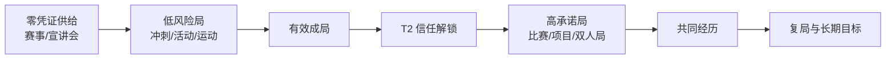
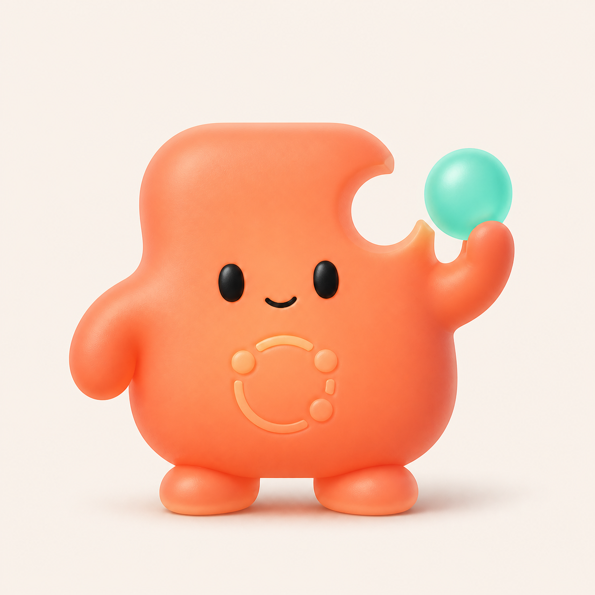

# 04 · 阿凑 IP 形象与文档设计评审

> 评审范围：`README.md`、产品方案 V2.1、iOS 客户端、后端服务、Hermes 设计
> 视觉交付：`../assets/ip/azou-candidate-v1.png`
> 结论日期：2026-08-11
> 状态更新：本页的“缺口连接块 V1”已转为初稿留档；当前 A–D 候选与动态系统见《05_阿凑动态IP候选与事件系统》。

---

## 0. 结论先行

当前方案已经形成一套很强的产品哲学和安全边界：**最小单元是“局”，关系由共同经历产生，AI 负责消除协调摩擦并在成局后退场。**

它已经足以支持答辩 Demo 和 P0 原型，但还不宜直接作为全量研发基线。主要原因不是功能不够，而是三类定义尚未完全收口：

1. **文档版本仍有旧口径残留**：认证方式、LLM 出口数、功能编号、页面数量互相矛盾。
2. **关系与授权状态不够精确**：群体关系和两两关系混在一个模型里，参加确认与真实动作授权也尚未彻底拆开。
3. **品牌视觉几乎空白**：有 `DesignSystem/` 目录名，却没有色板、字体、插画、角色、动效和暗色模式规则。

阿凑的 IP 方向建议定为：

> **一枚把最后一颗连接珠放进缺口、凑齐后主动退到角落的“小连接块”。**

可以借鉴“小火人”的**低复杂度轮廓、暖色、3D 玩具感和表情识别效率**，但必须反转其养成逻辑：阿凑不靠连续聊天长大、不求喂养、不制造陪伴、不以人格吸引停留。

---

## 1. 对当前产品设计的结构化理解

### 1.1 产品真正卖的不是匹配，而是“社交风险外包”

用户的阻力并不是找不到同学，而是：

- 不知道怎样自然开口；
- 不确定别人是否愿意；
- 害怕公开发起后没人响应；
- 多人协调时间和场地成本高；
- 临时退出会伤面子、伤关系；
- 匹配成功后，事情仍然没有真正发生。

“差一个”把这些高摩擦环节交给系统，最终交付的是：

```text
表达意图 → 匿名试探 → 凑齐人数 → 分别确认 → 真实预约 → 共同经历
```

因此它与传统社交产品最大的区别不是推荐算法，而是**失败归系统、成功归人**。

### 1.2 两个 AI 的分离是整套设计的价值观支点

| 角色 | 服务对象 | 用户期待 | 视觉语义 |
|---|---|---|---|
| `hermes` | 一个人 | 稳定、准确、随叫随到 | 工具、面板、结构化结果，不拟人化 |
| 阿凑 | 一个局 | 积极促成、完成后退场 | 小型媒介角色，可拟人但不可养成 |

这意味着**阿凑可以有 IP，hermes 不应该再拥有一个同等级人格 IP**。否则 UI 上已经建立的物理分离会被视觉再次混回去。

### 1.3 产品增长不是“刷人”，而是信任漏斗



这个漏斗比常见的 DAU、消息量和好友数增长模型更克制，也更符合产品主张。阿凑的视觉必须服务这个漏斗，不能反向制造“为了看角色而打开 App”的养成回路。

### 1.4 冷启动设计有四个彼此补位的来源

| 来源 | 是否需要登录 | 解决什么 |
|---|:---:|---|
| 经核验赛事库 | 否 | 让用户先看见真实目标；天然需要组队 |
| 宣讲会/招聘会 | 否 | 提供低压力公开局库存 |
| 同教学班关系 | 是 | 社交池为空时仍有天然连接理由 |
| 课表与选课画像 | 是 | Day 1 就有真实空档和可验证能力 |

这四个来源共同构成了方案最有说服力的部分：**先用校园事实降低填表和冷启动成本，再用真实成局产生行为数据。**

---

## 2. 当前文档设计的强项

| 强项 | 文档中的实现 | 评审判断 |
|---|---|---|
| 产品单元清晰 | 最小单元是“局”，不是“人” | 能有效阻止产品滑向刷人广场 |
| AI 价值观清晰 | 阿凑成局后退场，hermes 常驻办事 | 差异化强，适合作为品牌母题 |
| 隐私靠不可达保证 | 无他人等级接口、无原始日程字段、无评价字段 | 比“前端不展示”可靠得多 |
| 执行链路可信 | Preview → 多人确认 → 授权 → Execute | 是从匹配工具跃迁为行动产品的核心 |
| 匹配目标分型 | 搭子求相似，组队求互补 | 避免“一套推荐算法打天下” |
| 冷启动有事实资产 | 课程、教学班、空档、赛事快照 | Day 1 价值成立，不依赖历史行为 |
| 关系沉淀不评分 | 共同经历只记事实 | 能沉淀关系，又避开校园信用分风险 |
| 指标克制 | 看是否成局、是否复局，不看消息量 | 与产品原则基本一致 |

整体上，四份核心文档不是功能清单的堆砌，而是已经形成了**产品原则 → 接口能力 → 数据结构 → UI 红线**的传导链。这是当前设计最成熟的地方。

---

## 3. 需要先收口的文档与模型问题

### 3.1 P0：进入联调前必须修正

| # | 问题 | 位置 | 影响 | 建议 |
|---|---|---|---|---|
| 1 | V2.1 写“六条架构决议”，正文实际为八条 | `00_产品方案_V2.1.md:15` | 版本口径不可信 | 统一为八条 |
| 2 | 扫码认证与 WKWebView CAS 同时存在 | `00:125`、`00:1424` | iOS 会走出两套实现 | 删除 WKWebView 旧口径，只保留异步扫码会话 |
| 3 | `/auth/cas` 与 `/auth/session` 并存 | `00:1495`、`01:167`、`02:455` | API 契约冲突 | 产品方案同步为 `/auth/session` |
| 4 | 产品方案称 LLM 只有两个出口，后端定义三个 | `00:51`、`02:515-521` | 审计边界不一致 | 统一为“3 个内容出口、0 个执行出口” |
| 5 | App 在架构图中可直达 Action Schema | `00:228-242` | 与“客户端不直接调用”冲突 | 改为 App → onemore-server → actions → hermes |
| 6 | 参加确认与执行授权没有独立账本 | F10、E3、E5、`CampusAction` | 可能把“参加”误当成“授权提交” | 拆成 `ParticipationConfirmation` 与 `ActionAuthorization` |
| 7 | 关系既按两两写入，又出现 3 人关系卡 | `00:1134-1136`、`01:695-701`、`02:291-293` | 群聊归档、解除关系语义不确定 | 明确 `GroupRelation` 与 `PairRelation`，或只保留成员级可见状态 |
| 8 | 单方解除后“双方视图移除” | `01:725-732` | 一个人可改变另一人的历史视图 | 改为每个成员独立 `hidden_at/left_at`，不删除他人事实记录 |

### 3.2 P1：内测前必须补齐

| # | 问题 | 影响 | 建议 |
|---|---|---|---|
| 1 | “AI 退场成功率”一处说越低越好 | 成功率方向混乱 | 保留“退场成功率（越高越好）”，另设“退场后 AI 再介入率（越低越好）” |
| 2 | 人际对话一处埋“次数”，其他地方要求只记布尔 | 指标会被误用来优化消息量 | 服务端只产生 `bidirectional_conversation_started=true/false` |
| 3 | `ActionRequest.params: dict` 与“强类型”冲突 | 白名单仍可能成为宽参数入口 | 用 discriminator + 每动作独立 Pydantic 模型 |
| 4 | 状态机缺取消、过期、部分执行、改约版本 | 异常分支会散落在业务代码 | 补事件表与 transition matrix，动作快照带版本号 |
| 5 | 图片/位置消息已进入范围，但内容治理未定义 | 内测安全和存储成本不可控 | P0 先只上文本；图片与位置单独做权限、留存、举报链路 |
| 6 | 赛事表未进入产品方案的核心模型摘要 | 产品、后端口径漂移 | 将 CompetitionEvent/Skill/Constraint 加入 00 的 6.4 |
| 7 | `hermes` 会话失效文案写成“阿凑需要授权” | 两个 AI 再次混淆 | 所有个人校园授权提示只由 hermes 发出 |

### 3.3 P2：不阻塞 Demo，但会阻塞品牌一致性

- iOS 文档自称 56 个页面，按当前标题实际可识别 **74 个页面/子页面单元**；页面树中的 B 层数量也与正文不一致。
- `README.md` 仍写 F1–F30，产品方案已有 F31。
- F28–F31 按模块插入而非按编号排列，适合保持稳定 ID，但应增加一张“功能 ID → 模块 → 页面 → 服务”追踪矩阵。
- `DesignSystem/` 只有目录名，没有视觉 token、字体层级、栅格、圆角、阴影、色彩语义、暗色模式和 Reduced Motion 规范。
- 产品方案中的服务目录摘要缺 `competitions/`，`collab/` 也尚未反映 V2.1 的对话和账本扩展。

---

## 4. “小火人”参考应借什么、舍什么

公开资料显示，“小火人”依赖连续聊天、共同养成和形态解锁来强化既有关系。这正好与阿凑“成局后退场、不优化消息量、不做人格养成”的机制相反。[参考资料](https://www.thepaper.cn/newsDetail_forward_26956834)

因此参考只停留在**视觉效率层**：

| 可以借鉴 | 原因 |
|---|---|
| 单一强轮廓 | 24–48 pt 下仍能认出 |
| 2–3 个主色 | 贴纸、动效、推送图标易统一 |
| 低复杂度五官 | 小尺寸仍有情绪 |
| 软 3D 玩具材质 | 年轻、亲和、便于传播 |
| 少量高辨识动作 | 能形成截图记忆点 |

| 必须舍弃 | 与本产品的冲突 |
|---|---|
| 连续聊天成长 | 产品明确不优化聊天量 |
| 喂养、饥饿、求关注 | 会把 AI 变成陪伴对象 |
| 亲密度、火花天数 | 等价于关系评分与活跃度压力 |
| 主动闲聊和召回 | 违反 F20/F30 |
| 角色等级和稀有皮肤 | 容易把用户注意力从“事”移到“养角色” |

一句话：**借“看一眼就喜欢”，不借“每天回来养”。**

---

## 5. 候选 IP：阿凑 · 缺口连接块

### 5.1 角色母题

阿凑不是火焰、宠物或朋友，而是一块有生命的**连接器**：

- 身体右上角有一个明确的圆形缺口；
- 手里举着一颗薄荷色连接珠；
- 连接珠补上缺口时，代表约束已满足、局已凑齐；
- 完成后角色缩成一个小圆点，退到局信息条旁边；
- 人的对话进入主舞台。

这个母题同时表达：**差一个、补位、凑齐、退场**。

### 5.2 角色人格

| 维度 | 应该是 | 不应该是 |
|---|---|---|
| 工作方式 | 主动、利落、可解释 | 话多、卖萌、邀功 |
| 情绪 | 温暖、笃定、知趣 | 依赖、撒娇、求喂养 |
| 关系 | 临时媒介 | 用户的电子宠物 |
| 语言 | 短句、先说结果、给下一步 | 主动闲聊、情绪绑架 |
| 退场 | 完成后自然缩小 | 持续占据聊天区 |

推荐三词人格：**热心、靠谱、知趣**。

### 5.3 色彩建议

| Token | 色值 | 用途 |
|---|---|---|
| `Azou Coral` | `#FF765C` | 主体、阿凑气泡、关键动作 |
| `Warm Apricot` | `#FFB07A` | 高光与柔和渐变 |
| `Join Mint` | `#66E3CF` | 最后一颗连接珠、完成态 |
| `Action Charcoal` | `#22272B` | 五官与正文 |
| `Quiet Ivory` | `#FFF8F1` | 浅色背景 |

珊瑚橙负责“有人情味”，薄荷绿只在**凑齐、可执行、完成**的瞬间出现，避免全界面过度糖果化。

### 5.4 候选图



文件：`assets/ip/azou-candidate-v1.png`，1254 × 1254 PNG。

### 5.5 评审结论

| 维度 | 评价 | 说明 |
|---|---:|---|
| 产品隐喻 | 5/5 | 缺口与连接珠直接对应“差一个” |
| 亲和力 | 4.5/5 | 暖色、圆角、低复杂度五官成立 |
| 与参考的差异 | 4/5 | 非火焰轮廓，机制和道具完全不同 |
| 小尺寸识别 | 3.5/5 | 身体与缺口可识别，腹部浮雕在 48 pt 下会消失 |
| 动效潜力 | 5/5 | 珠子可吸附、弹回、缩点、复现补位 |
| 价值观一致性 | 5/5 | 天然支持“完成后退场” |

建议：**通过为视觉方向候选，不直接作为最终生产母版。** 下一版要把身体再做成更几何、可矢量化的轮廓，并验证 24/32/48 pt 图标尺寸。

---

## 6. 阿凑的动效系统

### 6.1 核心状态

| 产品状态 | 阿凑动作 | 时长建议 | 关键约束 |
|---|---|---:|---|
| 意图编译 | 连接珠绕一圈，字段逐项落位 | 600–900ms | 不做长时间“思考”表演 |
| 招募中 | 连接珠缓慢靠近又回到手中 | 1.8s 循环 | **不可用珠子数量暗示当前报名人数** |
| 满员待确认 | 连接珠靠近缺口，但暂不嵌入 | 400ms | 表示“人齐了，确认未齐” |
| 预约成功 | 连接珠吸附入槽，薄荷光环闭合 | 450–600ms | 只在真实 `Executed` 后完成闭环 |
| 阿凑退场 | 角色缩成珊瑚小点，滑入顶部局信息条 | 320–420ms | 随后群聊成为主体 |
| 被 @ 唤起 | 小点展开 → 执行动作 → 再缩回 | 500ms + 动作时间 | 用完即退，不跟聊 |
| 静默解散 | 珠子收回，角色与卡片一起淡出 | 240ms | 不悲伤、不指向任何人的拒绝 |

### 6.2 最重要的视觉红线

招募期不能显示报名人数，因此“缺口 + 一颗珠子”只能作为**品牌母题**，不能随真实报名人数从 1/4、2/4、3/4 动态变化。真实进度只在 F9 允许公开后进入确认卡。

### 6.3 Reduced Motion

- 开启“减弱动态效果”时，用透明度与颜色变化替代位移、缩放和弹簧动画。
- 任何循环动画在 3 次后停止，避免注意力竞争。
- 成功状态不能只靠薄荷绿色表达，需同时使用完成图形与 VoiceOver 文案。

---

## 7. 在 App 中出现在哪里

### 7.1 推荐出现

| 页面/组件 | 形态 | 作用 |
|---|---|---|
| D1 意图输入 | 64–88 pt 半身或头像 | 明确这是阿凑入口 |
| D2 澄清 | 28 pt 小头像 | 降低问答机械感，但最多两轮 |
| D4 招募中 | 96–120 pt 功能动效 | 承载“我在凑，不会公开失败” |
| E3 为什么是你们 | 小头像 + ReasonBlock | 表明解释来自阿凑 |
| E6 执行成功 | 一次完整“珠子入槽”动效 | 成为 Demo 高光 |
| E7 退场提示 | 从角色缩成 8–12 pt 小点 | 把位置交给人际对话 |
| E14 `@阿凑` | 小点展开的临时工具态 | 唯一重新出现入口 |
| G2 缺口分享卡 | 角落静态符号 | 强化品牌，不出现分享者身份 |

### 7.2 不应出现

- B 层“今天”首页和 hermes 结果卡；
- M3 信任等级与进度页；
- 搭子关系列表的主视觉；
- 推送召回、签到、连续使用天数；
- 任何“喂养、换装、升级、睡觉、想念你”的页面；
- 启动页超过 300ms 的品牌表演。

---

## 8. 阿凑的语言规范

### 8.1 推荐句式

| 场景 | 文案 |
|---|---|
| 编译完成 | “我把要做的事整理好了，确认一下。” |
| 招募中 | “我在凑。凑齐后再叫你。” |
| 未凑齐 | “这次没凑齐，我会按你选的时段继续留意。” |
| 满员 | “人齐了。你们分别确认后，我再去准备场地。” |
| 执行成功 | “A1302 已预约成功，日程也加好了。” |
| 退场 | “剩下的交给你们，需要改约或补位时再叫我。” |
| 被 @ | “场地还有两个可用时段，我放在上面了。” |

### 8.2 禁用句式

- “想我了吗？”
- “今天也来陪陪我吧。”
- “再聊几句我就升级啦。”
- “我饿了，喂我一点火花。”
- “你和某某已经很久没有一起活动了。”
- “再发 3 条消息解锁新皮肤。”

阿凑的台词判据只有一个：**每句话都应该推动事情向下一状态前进。**

---

## 9. 下一轮视觉交付建议

按优先级制作以下资产：

1. **二维矢量母版**：正面、3/4、侧面、背面；确定缺口几何和连接珠比例。
2. **尺寸测试**：24、32、48、64、96、256 pt；小尺寸移除腹部浮雕。
3. **六个功能状态**：编译、招募、待确认、执行成功、退场、被 @ 唤起。
4. **SwiftUI/Rive 或 Lottie 动效规范**：含 Reduced Motion 版本。
5. **深浅色背景适配**：珊瑚主体保持不变，调整描边与阴影。
6. **`AzouBubble` 与 `HermesResultCard` 对照稿**：验证两个 AI 在视觉上不会混淆。
7. **E7 Demo 镜头**：珠子入槽 → 阿凑缩点 → 人类消息出现，完整 2–3 秒。

不建议首轮制作表情包商店、皮肤、角色房间或成长等级；这些资产会把团队带向产品明确反对的方向。

---

## 10. 最终决策

- 产品文档：**方向成立，先做一次契约收口再进入全量开发。**
- IP 策略：**阿凑可拟人，hermes 保持工具化。**
- 候选形象：**“缺口连接块”进入下一轮，作为 V1 视觉方向。**
- 机制边界：**视觉可爱但不养成，动作积极但不陪聊，任务完成后必须能消失。**

阿凑最有辨识度的时刻，不是它一直站在那里，而是：

> **最后一颗珠子落位，事情成了，然后它把屏幕让给人。**
