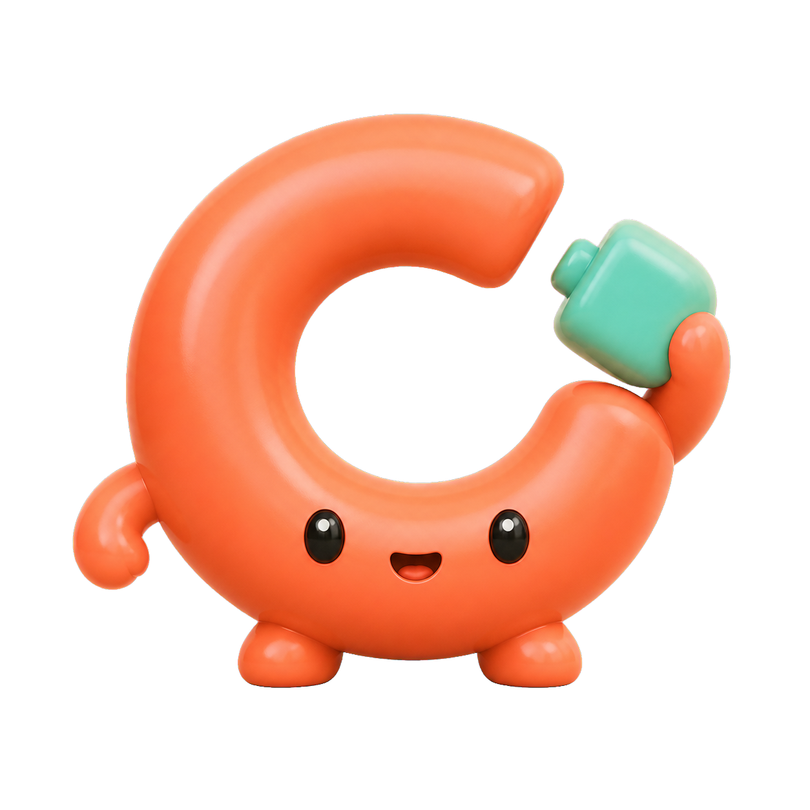
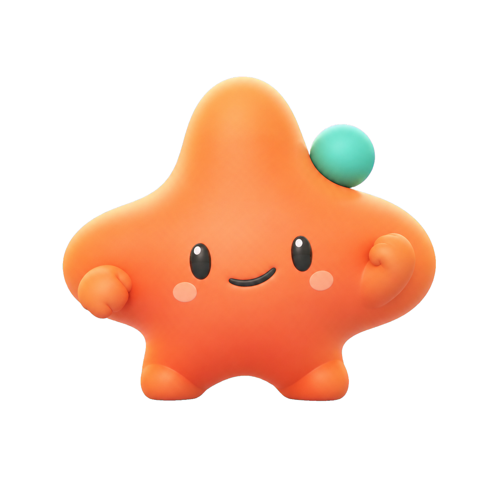
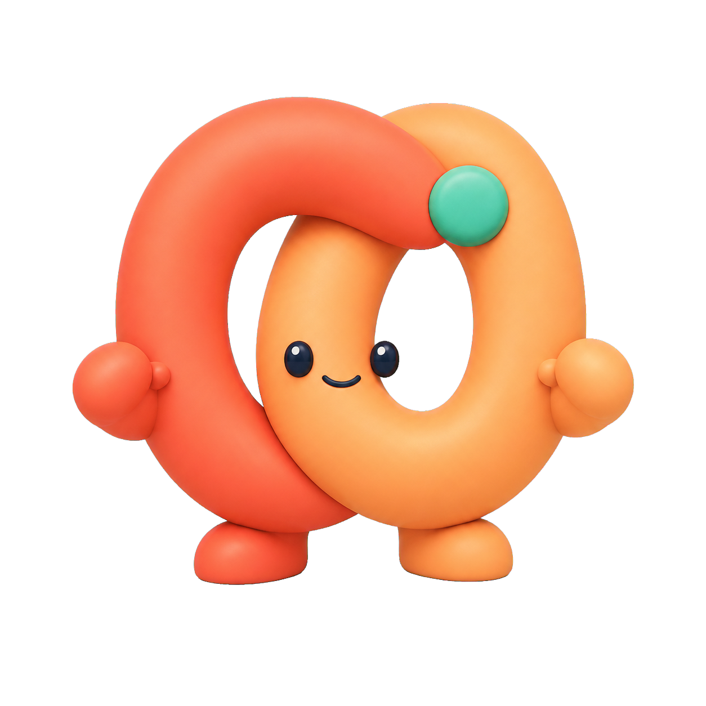
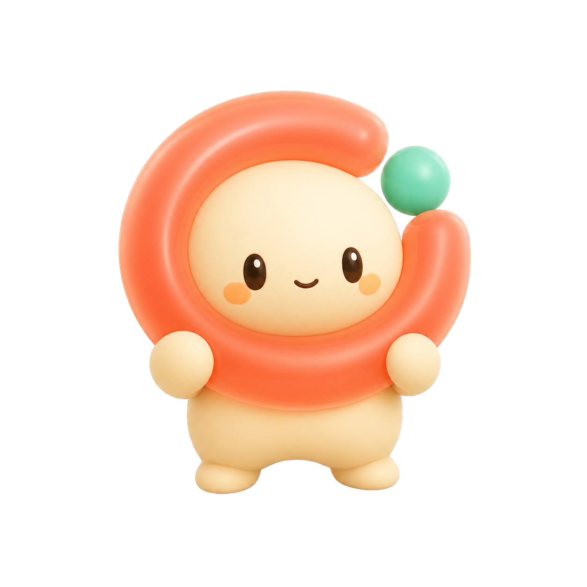

# 05 · 阿凑动态 IP 候选与事件系统

> 目标：先选定更可爱、更年轻且不复刻现有火焰角色的阿凑，再按 Codex Pat 式透明帧图集生产完整动作包。
> 历史选择结果：**D · 软糖团子**，V1 动态资产保留。当前选定形象与业务动作见 [10 · AIIA 粉发创变者业务动作交付说明](10_AIIA粉发创变者业务动作交付说明.md)。
> 候选资产：`../assets/ip/candidates/`
> 选定资产：`../assets/ip/selected/azou-d-v1/`
> 动作契约：`../assets/ip/animation/azou-motion-contract.v1.json`
> 候选预览：`../prototypes/azou-motion-preview/index.html`
> 最终逐帧预览：`../prototypes/azou-motion-preview/d-final.html`

---

## 1. 本轮采用的制作逻辑

本机 Codex 风格动态宠物使用固定 **8 列 × 9 行**的透明图集：每格 192 × 208 px，最终图集 1536 × 1872 px。九行动作分别为：

```text
idle · running-right · running-left · waving · jumping
failed · waiting · running · review
```

阿凑复用这套工程结构，但把动作语义改成产品事件：

| 原动作 | 阿凑语义 |
|---|---|
| `idle` | 安静待机、眨眼、轻微呼吸 |
| `running-right` | 从屏幕边缘出现、被 `@` 唤起 |
| `running-left` | 工作完成后退场 |
| `waving` | 首次进入阿凑入口时打招呼 |
| `jumping` | 真实预约执行成功 |
| `failed` | 中性受挫，不哭、不怪任何人 |
| `waiting` | 等待确认、授权、选择时段 |
| `running` | 正在凑人、补位、执行动作；不是跑步 |
| `review` | 编译意图、检查约束与预览 |

完整生产包共使用 **57 张透明动作帧**，其余 15 个图集槽位全透明。

---

## 2. 四个候选

### A · 凑环



- **母题**：一个未闭合的圆环，手里拿着最后一块插销。
- **优点**：产品含义最直接；轮廓最好记；连接、完成、退场都容易做动作。
- **风险**：造型更像品牌符号，情绪亲和力略低于 D；插销需要简化，避免像水壶。
- **动画潜力**：★★★★★

### B · 凑星



- **母题**：一枚软四角星，薄荷珠是“再来一个”的卫星。
- **优点**：最年轻、最活泼，小尺寸轮廓强，跳跃与庆祝动作最好看。
- **风险**：星形语义与“凑齐”关系弱；上方尖角仍可能被误读为火焰，需要下一版压低。
- **动画潜力**：★★★★☆

### C · 合扣



- **母题**：两个软连接环彼此扣住，代表因共同事情建立连接。
- **优点**：关系语义最完整；没有火焰相似性；品牌 Logo 延展空间大。
- **风险**：双环结构较复杂，192 × 208 小格内面部可能不够清晰；容易显得更“企业品牌”而不够灵动。
- **动画潜力**：★★★☆☆

### D · 软糖团子



- **母题**：奶油色小团子被未闭合的珊瑚软环包住，薄荷珠落位后闭环。
- **优点**：四个候选里最可爱、最年轻，面部最有亲和力；同时保留“缺口 + 最后一颗”的产品母题。
- **风险**：若身体比例继续幼化，会接近电子宠物；必须保持“能干的小助手”而不是“需要照顾的小宝宝”。
- **动画潜力**：★★★★★

---

## 3. 选择结果与原推荐顺序

| 排名 | 候选 | 推荐理由 |
|---:|---|---|
| 1 | **D · 软糖团子** | 最符合“更可爱、更年轻”的新要求，同时仍有连接缺口 |
| 2 | **A · 凑环** | 产品语义和动效延展最强，适合作为品牌符号型方案 |
| 3 | **B · 凑星** | 活泼但语义稍弱，可作为更娱乐化支线 |
| 4 | **C · 合扣** | 连接含义好，但小尺寸和动作成本最高 |

本轮已确认选择 **D**。A 继续保留为品牌符号型备选，但不再与 D 并行生产逐帧资产。

---

## 4. 事件触发系统

### 4.1 事件映射

| 产品事件 | 动作序列 | 说明 |
|---|---|---|
| 首次进入 D1 | 进入 → 招手 → 待机 | 每天最多一次，不拖慢启动 |
| 聚焦意图输入 | 检查 → 待机 | 表达“我在听”但不主动说话 |
| 开始编译意图 | 检查循环 | 最多两轮，随后停在静态帧 |
| 发布进入匿名池 | 工作三轮 → 待机 | 不持续动画数小时 |
| 满员待确认 | 等待 | 不能提前庆祝，真实执行尚未发生 |
| 行动预览完成 | 检查 → 等待 | 引导用户看参数并授权 |
| 开始执行 | 工作 | 表达系统正在办事 |
| 执行成功 | 跳起 → 退场 | Demo 的主高光 |
| 执行失败 | 中性泄气 → 等待 | 给下一步，不归因到成员 |
| 开始补位 | 工作 → 待机 | 复用“正在凑”语义 |
| 用户 `@阿凑` | 进入 → 检查 → 工作 | 唯一主动重新出现入口 |
| 回复完成 | 退场 | 用完即退 |
| 人际双向对话开始 | 退场 | 把画面主体让给人 |

### 4.2 明确不触发阿凑的事件

- 校园会话失效：由 **hermes** 提示；
- 信任等级变化：由系统 UI 展示；
- 每日回访、签到、连续使用：不存在；
- “很久没一起活动”：禁止主动召回；
- 群聊消息数量：不驱动角色成长与装扮。

### 4.3 调度规则

1. 同一时间只播放一个动作。
2. 成功与失败不可被普通动作打断。
3. 高优先级事件可抢占低优先级循环。
4. 循环动作最多 2–3 轮，随后静止，避免界面一直晃动。
5. 角色离屏或 App 进入后台立即暂停。
6. 开启 Reduced Motion 后直接使用各行动作的代表静态帧。

机器可读版本见 `assets/ip/animation/azou-motion-contract.v1.json`。

---

## 5. 透明帧资产规范

### 5.1 目录

```text
assets/ip/selected/azou-d-v1/
├── base-transparent.png
├── frames/{state}/{00...07}.png
├── previews/{state}.gif
├── previews/{state}.webp
├── spritesheet.webp
├── spritesheet.png
├── contact-sheet.png
├── motion-contract.json
├── pet.json
└── validation.json
```

### 5.2 一致性红线

- 每一帧保持同一轮廓、脸、眼距、材质、主色和薄荷珠位置逻辑；
- 不允许影子、地面、速度线、光晕、文字、气泡或脱离主体的星星；
- 所有未使用像素为真透明，透明像素不得残留洋红 RGB；
- 角色在 192 × 208 单格内完整，脚底基线稳定；
- 动作靠姿态变化表达，不依赖模糊与拖影；
- `failed` 只表达系统受挫，不能哭得像被某个用户拒绝；
- 招募动画不能用珠子数量显示当前报名人数。

---

## 6. 当前可运行预览

候选比较页：

```text
prototypes/azou-motion-preview/index.html
```

最终逐帧事件演示页：

```text
prototypes/azou-motion-preview/d-final.html
```

最终页可以：

- 切换浅色、深色、透明棋盘背景；
- 触发首次出现、被 `@`、整理、工作、等待、成功、未完成、退场和待机；
- 查看真实 57 帧图集播放器，而不是 CSS 形变；
- 同屏查看九组透明动画 WebP；
- 自动串行演示完整动作链路。

原候选页继续保留为选型过程记录；D 最终页已经全部替换为真实透明逐帧图。

---

## 7. 生产完成状态

- [x] 将 D 设置为唯一 canonical base；
- [x] 生成 `idle`、进入和退场三组基础动作；
- [x] 生成招手、成功、未完成、等待、工作、检查六组状态；
- [x] 提取 57 帧透明 PNG；
- [x] 组装 8 × 9 PNG/WebP 图集；
- [x] 生成九个 GIF、九个动画 WebP 与 Contact Sheet；
- [x] 完成透明通道、大小、边缘与图集结构检查；
- [ ] 正式接入 iOS `AzouMotionController`。

完整交付与 QA 见 [07 · 阿凑 D 动态资产交付说明](07_阿凑D动态资产交付说明.md)。
