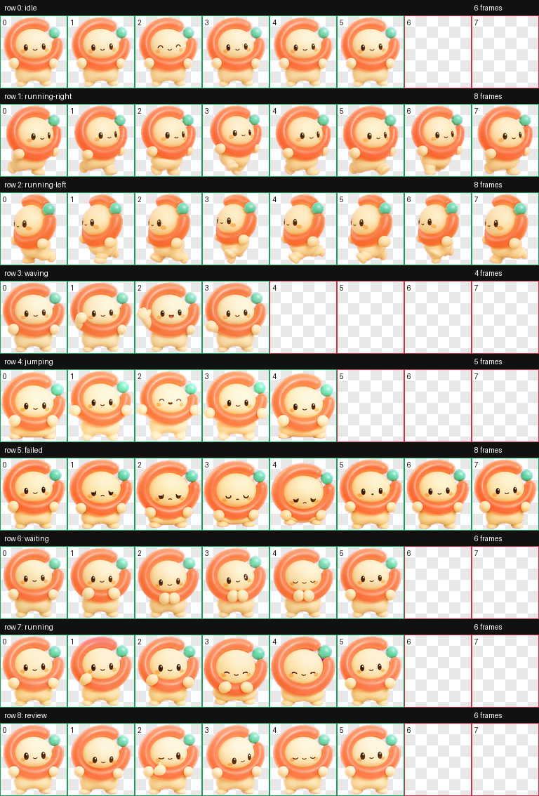
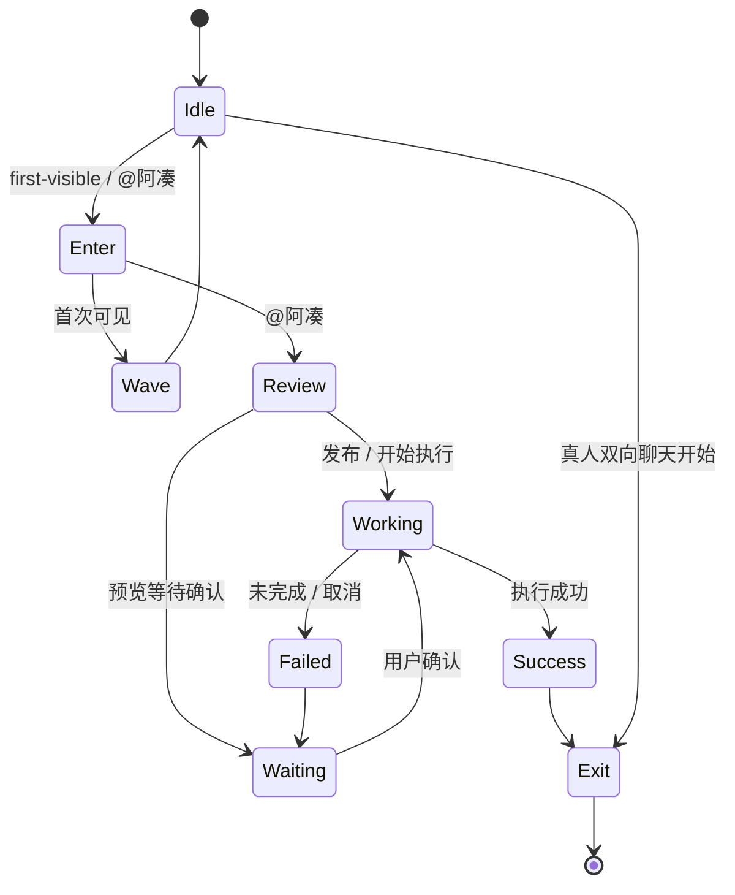

# 07 · 阿凑 D「软糖团子」动态资产交付说明

> 状态：**历史候选，V1 动态资产保留**  
> 角色 ID：`azou-d-v1`  
> 动态预览：`../prototypes/azou-motion-preview/d-final.html`  
> 资产根目录：`../assets/ip/selected/azou-d-v1/`
>
> 当前选定形象与业务动作见：[AIIA 粉发创变者业务动作交付说明](10_AIIA粉发创变者业务动作交付说明.md)。

---

## 1. 本轮结论

选择 **D · 软糖团子** 进入逐帧动态阶段。选择它不是因为“最像现有热门 IP”，而是因为它同时满足三件事：

1. **小尺寸仍可爱**：圆润低重心、眼距稳定，192×208 单格内面部依然可读；
2. **保留产品母题**：珊瑚软糖环的缺口与右上薄荷连接珠，仍然表达“差一个、凑上、成局”；
3. **能做行动型人格**：手、脚与软环都有动作支点，可以表达工作、等待、检查、成功和退场，不只会卖萌。

它与“小火人”一类角色共享的是**轻量陪伴、状态反馈、短动作循环**的产品机制；在造型上刻意使用“团子 + 不闭合连接环 + 薄荷珠”，不使用火焰轮廓、尖顶、火苗渐变或燃烧特效。

---

## 2. 已交付资产

| 资产 | 数量 / 规格 | 路径 |
|---|---:|---|
| 透明基准形象 | 1 张，RGBA PNG | `assets/ip/selected/azou-d-v1/base-transparent.png` |
| 独立透明帧 | **57 张**，每张 192×208 | `assets/ip/selected/azou-d-v1/frames/{state}/` |
| 运行时图集 | 1536×1872，8 列 × 9 行 | `assets/ip/selected/azou-d-v1/spritesheet.webp` |
| 无损图集 | 1536×1872，RGBA PNG | `assets/ip/selected/azou-d-v1/spritesheet.png` |
| 动作循环预览 | 9 个 GIF + 9 个动画 WebP | `assets/ip/selected/azou-d-v1/previews/` |
| 全帧总览 | 1 张 Contact Sheet | `assets/ip/selected/azou-d-v1/contact-sheet.png` |
| 角色清单 | 身份、图集与目录信息 | `assets/ip/selected/azou-d-v1/pet.json` |
| 动作契约 | 帧时长、事件、优先级、降动效 | `assets/ip/selected/azou-d-v1/motion-contract.json` |
| 生成提示词组 | 共享身份锁与九组动作分镜 | `assets/ip/selected/azou-d-v1/generation-prompts.md` |
| 结构验证 | 尺寸、RGBA、透明残留检查 | `assets/ip/selected/azou-d-v1/validation.json` |
| 真实事件演示 | 可点击的逐帧播放器 | `prototypes/azou-motion-preview/d-final.html` |

Contact Sheet：



---

## 3. 九个状态与动作设计

| 行 | 状态 | 帧数 | 动作内容 | 主要触发事件 |
|---:|---|---:|---|---|
| 0 | `idle` | 6 | 呼吸、微抬、眨眼、轻摆、回位 | 无事件时的低打扰基线 |
| 1 | `running-right` | 8 | 面向右侧的小步进入；容器同时横移 | 首次出现、被 `@阿凑` |
| 2 | `running-left` | 8 | 面向左侧的小步退场；容器同时横移 | 回复完成、真人对话开始 |
| 3 | `waving` | 4 | 手放下、抬起、向外招手、回落 | 首次进入入口 |
| 4 | `jumping` | 5 | 下蹲、起跳、腾空、下降、落地 | 真实行动执行成功 |
| 5 | `failed` | 8 | 轻微泄气、闭眼停顿、重新恢复 | 未完成、取消、池超时 |
| 6 | `waiting` | 6 | 双手靠拢、前倾、歪头、耐心眨眼 | 确认、授权、选择时段 |
| 7 | `running` | 6 | 双手交替触碰软环、专注下压与回弹 | 匹配、补位、动作执行中 |
| 8 | `review` | 6 | 左右检查、单眼思考、慢眨眼、点头 | 意图编译、预览检查 |

### 动作语言的关键区分

- `idle` 只做呼吸和眨眼，不能像“工作中”；
- `waiting` 用双手靠拢和期待眼神，不能仅仅是另一套待机；
- `running` 在产品语义里表示**任务运行中**，脚保持原地，不做字面跑步；
- `review` 用视线、歪头和点头表达检查，不新增放大镜、纸张或 UI 道具；
- `failed` 是“任务这次没有完成”，不是“被某个人拒绝”，不流泪、不责怪；
- `running-left` 不是简单镜像。薄荷珠必须始终留在角色自身右上方，因此单独生成了左向姿态。

---

## 4. 事件播放链路



运行时调度遵循：

1. 同一时刻只播放一个状态；
2. 高优先级事件抢占普通循环；
3. 成功与未完成先完整播放，再进入下一状态；
4. `idle`、`waiting`、`running`、`review` 最多循环 2–3 次，之后停在代表帧；
5. 离屏、切后台立即暂停；
6. Reduced Motion 直接显示动作契约中的 `reducedMotionColumn`；
7. 进入与退场同时使用**逐帧步态 + 角色容器位移**，不是只移动静态图片。

---

## 5. 图集运行时约定

图集固定为 8 列 × 9 行，每格 192×208。某一帧的像素坐标为：

```text
x = column × 192
y = row × 208
w = 192
h = 208
```

不要把每行动作按统一 FPS 粗暴播放。每帧时长已在 `motion-contract.json` 中单独配置，例如招手为：

```json
{
  "state": "waving",
  "row": 3,
  "durationsMs": [140, 140, 140, 280]
}
```

最后一帧故意停得更久，动作才会有“抬手—挥动—收住”的节奏，而不是机械轮播。

---

## 6. 视觉 QA 结果

自动检查结果：

- 使用帧数：**57 / 57**；
- 单帧尺寸：**192×208**；
- 图集尺寸：**1536×1872**；
- 图集格式：`WEBP`，模式：`RGBA`；
- 未使用槽位：全透明；
- 透明像素 RGB 残留：**0**；
- Connected Component 提取：九行动作全部成功；
- 帧检查：**0 error / 0 warning**。

人工检查重点：

- 右上薄荷珠在非方向动作中保持同侧；
- 各行动作没有地面、影子、文字、速度线和漂浮符号；
- 成功跳跃只靠垂直位置表达；
- 失败动作不会变成哭泣或被拒绝叙事；
- 深色、浅色、透明棋盘三种背景均可读；
- 小尺寸下脸、软环缺口和薄荷珠仍能辨识。

### V2 精修建议

V1 已足够用于方向评审与客户端动效验证。若确定作为正式品牌 IP，下一轮只做三类精修，不重新推翻角色：

1. 统一 `running` 个别帧顶部软环的高光色温；
2. 统一 `waving` 抬手过程中的手掌分指程度；
3. 将左右步态的身体高度和脚底基线再做一次逐像素校准。

---

## 7. 生成方法与提示词组

本轮使用内置 `image_gen`，每个状态独立生成一条横向动作带；背景统一为纯 `#FF00FF`，随后进行本地色键透明化、连通组件提取、192×208 归一化和图集组装。

九组最终提示词共享四条约束：

1. **身份锁定**：奶油团子、珊瑚软糖环、角色自身右上薄荷珠、固定脸型与比例；
2. **动作分镜**：明确每一帧的起势、中间态、峰值和回位；
3. **提取约束**：纯色背景、完整全身、等距槽位、无重叠和裁切；
4. **排除项**：无火焰、耳朵、头发、服装、文字、影子、地面、拖影与脱离主体的特效。

工作态因个别帧珊瑚环色温漂移执行过一次定向重生成；其余八组一次通过。所有原始生成条带和生产清单保存在：

```text
output/azou-d-motion-v1/
```

---

## 8. 评审入口

直接打开：

```text
prototypes/azou-motion-preview/d-final.html
```

页面提供：

- 首次出现、被 `@`、整理意图、正在凑、等待确认、执行成功、暂未完成、完成退场九类事件；
- 浅色、深色与透明棋盘背景；
- 自动串行动作演示；
- 九组动画 WebP 同屏预览；
- 当前图集行号、帧号与事件队列显示。

本轮评审只需回答三个问题：

1. 角色是否已经达到“年轻、可爱，但仍像能干助手”的平衡；
2. `running` 与 `review` 是否能让人理解阿凑正在办事，而不是无意义卖萌；
3. 成功后主动退场是否符合“AI 促成事，关系留给人”的产品人格。
