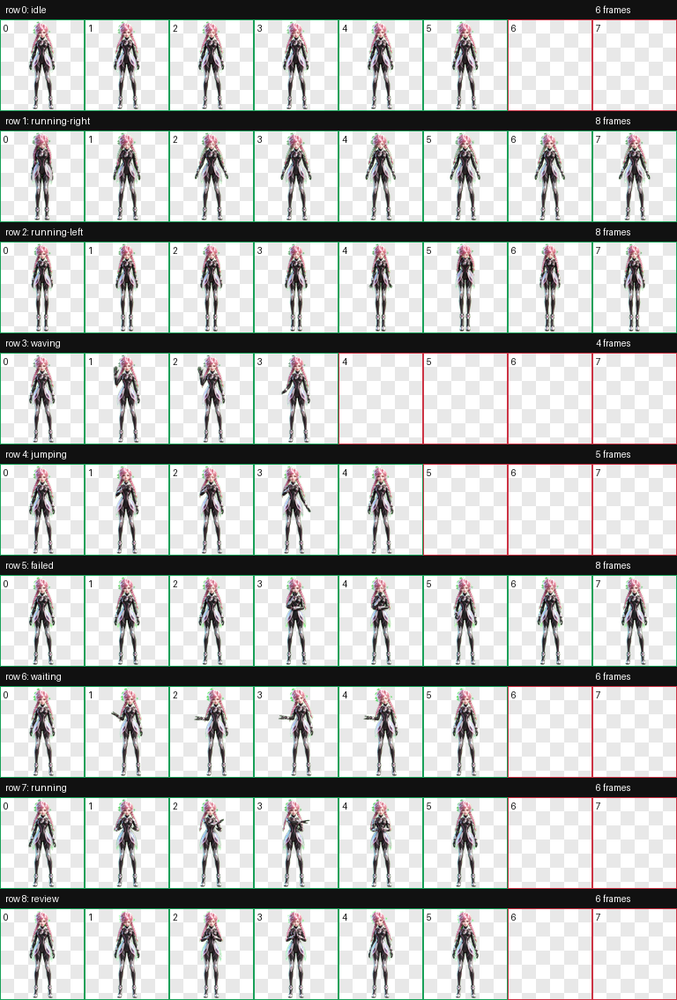
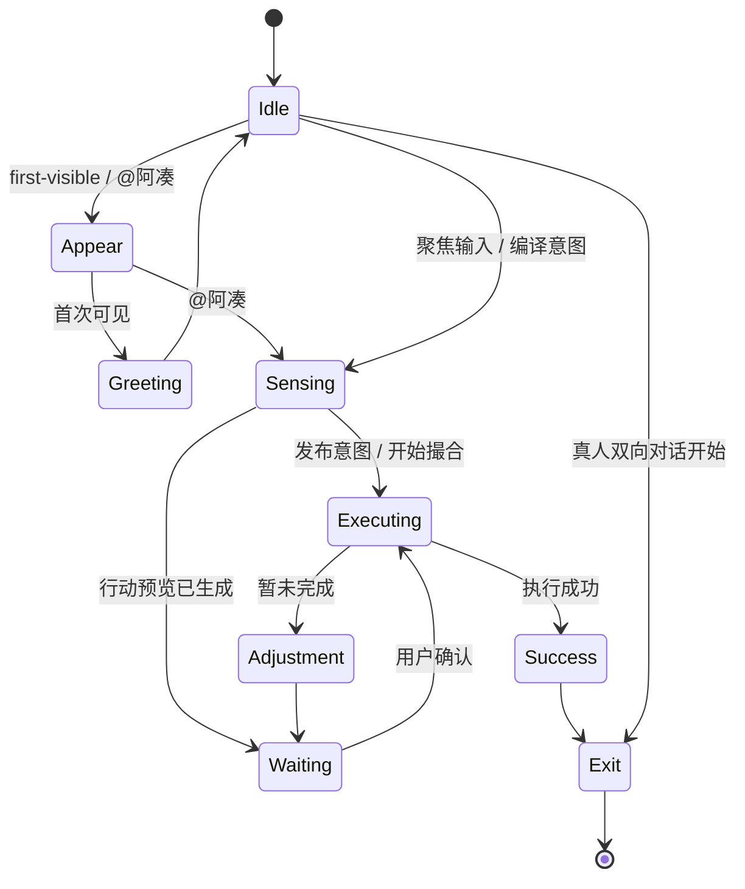

# 10 · AIIA 粉发创变者业务动作交付说明

> 状态：**当前选定，V1 业务动作已完成**  
> 角色 ID：`aiia-pink-girl-business-v1`  
> 资产根目录：`assets/ip/selected/aiia-pink-girl-business-v1/`  
> 事件演示：`prototypes/aiia-pink-girl-motion-preview/index.html`

---

## 1. 本轮结论

正式使用已经确认的 AIIA 粉发创变者形象，并把动作方向从“桌面宠物移动”调整为“业务状态可视化”。本轮不生产左右跑动，核心原因是阿凑不是需要被养成的宠物，而是一个在关键节点短暂出现、帮助成局、完成后主动退场的业务型 AI 伙伴。

动作设计围绕五个业务问题：

1. 她何时出现，但不打扰用户；
2. 她如何表达“已经理解你的意图”；
3. 她如何表达“正在撮合或执行”；
4. 她如何请求确认、反馈成功或提示需要调整；
5. 真人关系开始后，她如何自然让位。

角色视觉参考来自[抖音 AI 创变者计划 2026 官网](https://aiia.douyin.com/)。官网视频中安静、闭眼、感知式的气质被转化为本套动作的主识别动作 `closed-eye-sensing`。

---

## 2. 已交付资产

| 资产 | 数量 / 规格 | 路径 |
|---|---:|---|
| 透明基准形象 | 1 张 RGBA PNG | `assets/ip/selected/aiia-pink-girl-business-v1/base-transparent.png` |
| 独立透明帧 | **57 张**，每张 192×208 | `assets/ip/selected/aiia-pink-girl-business-v1/frames/` |
| 运行时 WebP 图集 | 1536×1872，8 列 × 9 行 | `assets/ip/selected/aiia-pink-girl-business-v1/spritesheet.webp` |
| 无损 PNG 图集 | 1536×1872，RGBA | `assets/ip/selected/aiia-pink-girl-business-v1/spritesheet.png` |
| Retina 演示图集 | 3072×3744，每格 384×416 | `assets/ip/selected/aiia-pink-girl-business-v1/spritesheet@2x.webp` |
| 动作循环预览 | 9 个 GIF + 9 个动画 WebP | `assets/ip/selected/aiia-pink-girl-business-v1/previews/` |
| Retina 动作预览 | 9 个 384×416 动画 WebP | `assets/ip/selected/aiia-pink-girl-business-v1/previews@2x/` |
| 全帧总览 | 1 张 Contact Sheet | `assets/ip/selected/aiia-pink-girl-business-v1/contact-sheet.png` |
| 动作契约 | 状态、逐帧时长、事件序列、优先级、降动效 | `assets/ip/selected/aiia-pink-girl-business-v1/motion-contract.json` |
| 角色清单 | 身份、来源、图集与业务状态映射 | `assets/ip/selected/aiia-pink-girl-business-v1/pet.json` |
| 最终提示词组 | 共享身份锁与九组动作分镜 | `assets/ip/selected/aiia-pink-girl-business-v1/generation-prompts.md` |
| 自动 QA | 图集验证、逐帧检查、生成任务记录 | `assets/ip/selected/aiia-pink-girl-business-v1/validation.json`、`qa/` |
| 浏览器事件演示 | 点击业务事件播放真实图集 | `prototypes/aiia-pink-girl-motion-preview/index.html` |

Contact Sheet：



---

## 3. 九个业务状态

| 行 | 业务状态 | 帧数 | 动作内容 | 主要触发场景 |
|---:|---|---:|---|---|
| 0 | `idle` | 6 | 冷静注视、呼吸、短暂闭眼、回位 | 无事件时的低打扰基线 |
| 1 | `appear` | 8 | 低头闭眼休眠，逐步睁眼并就位 | 首次可见、被 `@阿凑` |
| 2 | `exit` | 8 | 由在场到闭眼收束并休眠 | 回复完成、真人双向对话开始 |
| 3 | `greeting` | 4 | 抬手、短招呼、克制回落 | 首次进入阿凑入口 |
| 4 | `success` | 5 | 手触胸口、闭眼点头、冷静确认 | 真实行动执行成功 |
| 5 | `needs-adjustment` | 8 | 聚焦分析、闭眼重算、托腮、恢复就绪 | 未完成、取消、池超时、需要补充条件 |
| 6 | `waiting-confirmation` | 6 | 掌心打开、轻微歪头、慢眨眼、回位 | 确认、授权、选择时段 |
| 7 | `executing` | 6 | 双手依次横向整理不可见约束，在中线汇合后回位 | 匹配、补位、发布、动作执行 |
| 8 | `closed-eye-sensing` | 6 | 下颌轻落、闭眼、双手靠近中线、半睁眼、恢复 | 意图理解、约束编译、预览检查 |

### 固定图集兼容映射

为了复用既有 8×9 客户端图集协议，图集源行仍保留历史技术名称，但业务代码只使用新的语义名：

| 业务状态 | 图集源行 |
|---|---|
| `appear` | `running-right` |
| `exit` | `running-left` |
| `greeting` | `waving` |
| `success` | `jumping` |
| `needs-adjustment` | `failed` |
| `waiting-confirmation` | `waiting` |
| `executing` | `running` |
| `closed-eye-sensing` | `review` |

这只是行号兼容，不代表动作内容。容器层也不添加左右位移；显现与退场只使用轻微纵向位移、缩放、透明度和模糊度变化。

---

## 4. 为什么这套动作更贴合当前业务

### 4.1 闭眼感知是主识别动作

`closed-eye-sensing` 同时承担品牌识别与产品解释：用户聚焦输入、阿凑整理多人约束、行动预览生成时，都可以用同一套动作建立“她正在理解，而不是卡住”的预期。

动作保持安静，不加入代码、全息屏、魔法粒子或悬浮符号，避免抢夺页面信息层级，也避免把 AI 能力表达成廉价“科技特效”。

### 4.2 执行中不是字面跑步

`executing` 以双手依次横向整理、在中线汇合来表达：

- 汇总多人时间与地点约束；
- 正在凑人、补位或匹配；
- 正在调用 Hermes 行动；
- 正在回填行动结果。

脚始终原地，既符合“阿凑正在处理任务”，也不会造成角色要离开屏幕的错误预期。

### 4.3 成功是确认，不是庆典

成功动作取消跳跃、撒花和夸张欢呼，改为手触胸口与闭眼点头。它更酷、更短，也更符合“AI 促成事，关系留给人”的人格：确认结果后直接进入 `exit`，不继续占据社交场景。

### 4.4 暂未完成是调整，不是失败人格

`needs-adjustment` 先分析、再重算、最后恢复就绪。它不哭、不摊手、不把原因归结到某个人，也不制造被拒绝叙事；后续进入 `waiting-confirmation`，自然承接“补条件、换时间或再次确认”。

---

## 5. 事件播放链路



核心事件映射：

```text
azou.entry.first-visible            → appear → greeting → idle
intent.input.focused                → closed-eye-sensing → idle
intent.compile.started              → closed-eye-sensing
intent.published                    → executing → idle
action.preview.ready                → closed-eye-sensing → waiting-confirmation
action.execute.started              → executing
action.execute.succeeded            → success → exit
action.execute.failed               → needs-adjustment → waiting-confirmation
chat.azou.mentioned                 → appear → closed-eye-sensing → executing
chat.human.bidirectional-started    → exit
```

---

## 6. 客户端接入约定

图集固定为 8 列 × 9 行，每格 192×208：

```text
x = column × 192
y = row × 208
w = 192
h = 208
```

Swift 侧建议只暴露业务状态，不让页面知道历史源行名：

```swift
enum AzouMotion: String {
    case idle
    case appear
    case exit
    case greeting
    case success
    case needsAdjustment
    case waitingConfirmation
    case executing
    case closedEyeSensing
}
```

播放器从 `motion-contract.json` 读取行号和逐帧时长。不要以统一 FPS 轮播，也不要在页面内硬编码 `running-right` 等兼容名称。

产品内按实际显示尺寸选择图集：角色显示宽度不超过约 170pt 时使用 1× 图集；桌面演示或大尺寸预览使用 `spritesheet@2x.webp`。避免把 192×208 的单格直接放大到接近 400px。

运行时规则：

1. 同一时刻只播放一个状态；
2. 高优先级结果事件抢占普通循环；
3. `success` 与 `needs-adjustment` 完整播放，不在中间切断；
4. 长循环最多 2–3 次，之后停到代表帧或回到 `idle`；
5. 离屏与 App 进入后台立即暂停；
6. Reduced Motion 使用契约中的 `reducedMotionColumn`；
7. 进入和退场关闭水平移动，避免宠物式乱跑。

---

## 7. 视觉与结构 QA

自动检查结果：

- 使用帧数：**57 / 57**；
- 单帧尺寸：**192×208**；
- 图集尺寸：**1536×1872**；
- 图集模式：`RGBA`；
- 九行动作全部通过 Connected Component 提取；
- 未使用槽位全透明；
- 透明像素 RGB 残留：**0**；
- 帧检查：**0 error / 0 warning**。

人工检查结果：

- 粉色双辫、斜刘海、角色自身左上花冠在九组动作中保持一致；
- 头身维持确认后的平衡比例，身体和腿不再细长；
- 动作条带无文字、UI、地面、影子、速度线和游离粒子；
- `appear` / `exit` 没有字面跑动；
- `executing` 与 `closed-eye-sensing` 的语义可区分；
- 浅色、深色和透明棋盘背景均可读。

---

## 8. 生成方法

本轮使用内置 `image_gen`，以确认后的透明基准形象、固定槽位布局图和官网情绪参考为输入；每个状态独立生成纯 `#00FF00` 横向动作带，再进行本地色键透明化、连通组件提取、192×208 归一化、图集组装和 GIF/WebP 编码。

最终提示词组保存在：

```text
assets/ip/selected/aiia-pink-girl-business-v1/generation-prompts.md
```

完整生产中间件保存在：

```text
output/aiia-pink-girl-business-motion-v1/
```

---

## 9. 评审入口

直接打开：

```text
prototypes/aiia-pink-girl-motion-preview/index.html
```

页面支持：

- 首次出现、聚焦输入、整理意图、正在凑、等待确认、执行成功、暂未完成、真人对话退场；
- 自动串行动作演示；
- 深色、浅色、透明棋盘背景；
- 九组动画 WebP 同屏预览；
- 当前业务状态、图集行号、帧号与事件队列显示。
