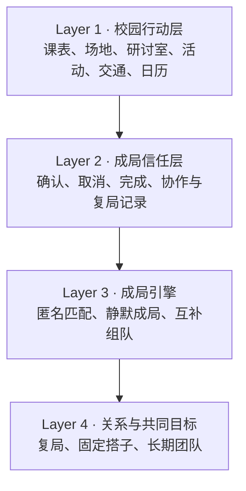
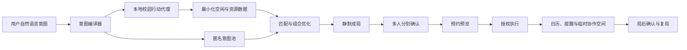

# 差一个 · ONE MORE

## 校园社交连接器融合产品规划方案 V1.0

> 产品：差一个 / ONE MORE  
> 智能体：阿凑  
> Slogan：校园里所有的“还差一个”，AI 帮你凑齐。  
> 核心主张：AI 不介绍人，AI 促成事。

---

## 0. 执行摘要

### 0.1 一句话定义

**差一个是一个能在用户授权下执行真实校园预约的 AI 成局智能体。它把每个人主动表达的目标、共同空档和历史成局记录组合起来，匿名凑齐合适的同伴，并把场地、活动与日程真正落实。**

### 0.2 产品公式

```text
差一个 = 校园行动引擎 sysu-anything
       + 匿名意图与匹配引擎
       + 多人确认协议
       + 成局信任系统
       + AI 退场后的轻协作空间
```

### 0.3 产品不是什么

- 不是一个让学生继续刷人的校园社交广场。
- 不是一个以聊天时长为目标的 AI 陪伴产品。
- 不是只推荐联系人、后续仍由用户自己协调的匹配工具。
- 不是公开展示个人“信用分”的校园评价系统。

### 0.4 最核心的产品结果

不是“匹配成功”，而是：

> **一群原本不认识或不熟悉的人，在共同目标下完成确认、预约并真实成局。**

### 0.5 北极星指标

**有效成局数：满员并完成多人确认，且预约/活动真实成立，活动结束后得到参与者完成确认的局数。**

### 0.6 首个英雄场景

**比赛互补组队 → 协调共同时间 → 预约研讨室 → 同步日历 → AI 退场。**

这个场景同时呈现 AI 理解目标、互补匹配、时间协调、真实预约、线下协作五项能力，并能直接复用 `sysu-anything` 已具备的课表、研讨室预约成员和日历能力。

---

## 1. 赛题洞察与产品判断

### 1.1 学生缺的不是“可认识的人”，而是自然开口的理由

校园里人与人的物理距离很近，但社交心理距离并不近。阻碍学生连接的主要问题通常是：

- 不知道怎样开口才不显得突兀；
- 害怕被拒绝或暴露过强需求；
- 不愿承担发起后人数不足的尴尬；
- 找到了同好，但时间始终对不上；
- 组队后还要反复协调场地、日程和分工；
- 高价值协作中最担心的不是能力不够，而是队友不出现、不回应、不完成。

因此，AI 的价值不是多推荐几个人，而是承担社交中高摩擦的部分：表达需求、匿名试探、协调时间、凑齐人数、执行预约和处理失败。

### 1.2 关系不是靠匹配结果建立，而是靠共同经历建立

“你们都喜欢音乐”只能产生一个话题；“你们周四一起完成了一次排练”才可能产生关系。

差一个的产品单元不是“人”，而是“局”：

- 一次羽毛球局；
- 一次比赛筹备会；
- 一次跨校区同行；
- 一次宣讲会同行与复盘；
- 一次两小时的作业冲刺；
- 一个持续四周的共同目标。

### 1.3 AI 应当成为媒介，而不是社交对象

阿凑在成局前积极，在成局后克制：

- 成局前：理解目标、找人、解释匹配、协调并执行；
- 成局时：生成一条基于共同任务的开场信息；
- 成局后：退出日常对话，只保留提醒、改约、补位和任务协助；
- 关系形成后：允许用户绕过 AI 自发复局。

因此真正有价值的不是“AI 对话时长”，而是 AI 完成工作后，人和人是否开始互动并再次见面。

---

## 2. 产品与现有 Skill 的关系

### 2.1 清晰分工

- **差一个**：面向学生的产品、社交协议与成局体验。
- **sysu-anything**：在用户授权下查询和执行校园服务的行动引擎。

可以用一句技术叙事概括：

> `sysu-anything` 让 AI 有手，“差一个”让这双手不只替一个人办事，而是把几个人真正凑到一起。

### 2.2 已有能力、待建能力与后续能力

| 层级 | 能力 | 当前状态 | 在差一个中的作用 |
|---|---|---:|---|
| 校园行动 | 个人课表、今日课程、空闲时间推导 | 已具备 | 只输出共同空档，不公开原始课表 |
| 校园行动 | 体育场馆查询与预约 | 已具备 | 运动搭子成局后的真实执行 |
| 校园行动 | 图书馆研讨室查询与多人预约 | 已具备 | 比赛组队、自习组队最强闭环 |
| 校园行动 | 组会、课题查询与报名 | 已具备 | 科研兴趣连接与会前同行 |
| 校园行动 | 宣讲会、招聘会、岗位查询及部分报名 | 已具备 | 求职同行、面试搭子、会后复盘 |
| 校园行动 | 跨校区班次查询、下单入口 | 部分具备 | 可匹配计划行程；当前不等于真实购票 |
| 校园行动 | 作业与 DDL 查询 | 已具备 | 发起限时自习与作业冲刺局 |
| 校园行动 | Apple 日历与提醒 | 已具备 | 成局后落地到个人日程 |
| 社交协议 | 匿名意图卡、社交池 | 待建设 | 让需求先被看见，身份后被公开 |
| 社交协议 | 多人确认状态机 | 待建设 | 所有人同意后再执行真实动作 |
| 匹配系统 | 节律匹配、互补组队 | 待建设 | 分别服务搭子和团队场景 |
| 信任系统 | 成局记录、取消记录、复局记录 | 待建设 | 形成不公开的匹配侧可靠性分层 |
| 到场验证 | 校方签到、核销、门禁凭证 | 后续合作 | 强化真实履约判断，不作为当前既有能力宣称 |

### 2.3 对外表述

对外不强调“拿到了系统写权限”，而强调：

> **已验证从校园信息查询、空档发现、操作预览到用户授权提交的真实执行闭环。**

这既体现技术能力，也能自然回答权限来源、用户授权和系统稳定性问题。

---

## 3. 目标用户与核心任务

### 3.1 初始目标用户

1. **想参加活动但不愿主动发帖的人**  
   有意愿，缺少自然开口方式。

2. **经常需要凑人数的校园运动用户**  
   有稳定需求，受时间、水平和场地约束。

3. **需要跨专业能力的参赛者**  
   找人难、判断可靠性更难，协作价值高。

4. **想扩展弱关系但不想“纯社交”的学生**  
   愿意通过一件具体的事认识人。

5. **容易错过校园机会的人**  
   需要 AI 从活动、组会、宣讲会和 DDL 中发现可参与的行动。

### 3.2 用户任务

```text
当我想做一件需要其他人的校园活动时，
帮我用尽可能低的社交压力找到合适的人，
协调好时间与资源，
并让这件事真的发生。
```

---

## 4. 产品架构

### 4.1 四层架构



### 4.2 完整数据流



---

## 5. 核心功能规划

## F1. 场景化“差一个”入口｜P0

产品不以空白社交广场作为入口，而是在真实行动节点询问用户是否需要同伴。

| 用户正在做什么 | 产品触发 |
|---|---|
| 查询羽毛球场 | “这个时段有场，还差一起打的人吗？” |
| 预约研讨室 | “房间最多 4 人，要不要凑一支讨论小组？” |
| 查看比赛或课题 | “你缺队友，还是想找同行报名的人？” |
| 查看跨校区班次 | “要不要加入同一班次的匿名同行池？” |
| 查看作业 DDL | “今晚开一个 90 分钟冲刺局吗？” |
| 报名宣讲会 | “已有同学准备会后一起复盘，要加入吗？” |

价值：用户为办事而来，社交是自然出现的第二步，不需要先被说服下载一个“交朋友 App”。

## F2. AI 匿名意图卡｜P0

用户只需说一句自然语言，AI 将其整理为可匹配结构：

```text
目标：参加 AI 应用比赛
已有能力：后端、模型调用
需要角色：前端、产品、视觉
目标强度：认真完赛，有机会争奖
时间：周二晚上、周六下午
校区：珠海校区
人数：4 人
社交模式：满员后再公开身份
```

用户可逐项修改，并明确选择公开范围。

## F3. 静默成局｜P0

核心规则：

1. 未满员前，报名情况对其他参与者不可见；
2. 满员后，系统分别通知每个人确认；
3. 只有达到成局条件，才公开必要身份信息；
4. 未成局自动结束，不显示“谁拒绝了谁”；
5. 可选择固定截止时间与最低人数；
6. 场地失效时，AI 自动计算下一组共同可行时段。

这让 AI 成为发起者和失败承担者，用户不会因为人少、被拒绝或临时取消而丢面子。

## F4. 双模式匹配引擎｜P0

### 搭子匹配：强调相似和节律

适用运动、自习、同行、活动参与：

```text
目标一致 + 时间重合 + 地点便利 + 水平接近 + 互动偏好相容
```

建议初始权重：

| 维度 | 权重 |
|---|---:|
| 时间重合 | 30% |
| 目标一致 | 25% |
| 地点便利 | 15% |
| 水平或强度相近 | 15% |
| 互动偏好 | 10% |
| 成局可靠性同层 | 5% |

### 队友匹配：强调互补和共同承诺

适用比赛、科研、课程项目：

```text
最大化：技能覆盖度 + 目标一致度 + 共同时间 + 协作可靠性
约束：人数、必需角色、地点、截止时间和工作量
```

原则：

> **同好靠相似连接，同伴靠互补连接。**

## F5. 可执行的多人确认协议｜P0

现有 `sysu-anything` 的“先预览、后确认执行”可以直接成为产品交互：

```text
比赛第一次碰面
时间：周六 14:00–16:00
地点：珠海校区 A1302
成员：4 人
预约状态：可预约

3/4 人已确认

[确认参加] [修改时间] [退出本局]
```

执行规则：

- 团体预约：所有成员确认后，由预约发起人的授权代理提交成员信息；
- 个人报名：每个参与者在自己的账号下分别确认和提交；
- 系统不支持代办时：退化为一键打开官方入口，但保留成局与协调能力；
- 预约成功后才同步日历，避免形成无效日程。

## F6. 轻协作空间与 AI 退场｜P0

成局后生成一个临时空间，只提供完成这件事所需的信息：

- 集合时间、地点与路线；
- 基于真实共同目标的一条开场信息；
- 第一次会议议程或活动规则；
- 角色和待办；
- 改约、补位与取消；
- 必要提醒。

阿凑完成开场后降低存在感：

> “你们四个人的共同空档是周六下午，研讨室已经预约成功。第一次会议建议先确认赛题和分工，剩下的交给你们，我在需要改约或补位时再出现。”

## F7. 成局信任层｜P1

不做公开信用分，只建立匹配侧的静默分层。

第一阶段可使用的数据：

- 是否按时确认；
- 是否提前足够时间取消；
- 是否在临近开始时退出；
- 预约是否真实成功；
- 活动后是否得到多数成员“已完成”确认；
- 是否与原成员再次复局；
- 团队是否完成关键里程碑。

用户只感知匹配体验，不看到其他人的具体评分：

> “本次优先匹配了节奏接近、确认习惯相似的成员。”

## F8. 补位与容错｜P1

“差一个”不只负责第一次找人，还负责局发生变化后的修复：

- 有人退出后自动回到匿名候选池；
- 临时补位者只看到必要信息；
- 无法补齐时给出降级方案，如双打改练球、线下改线上；
- 场地失效时自动寻找相邻时段或同类资源；
- 对比赛队伍设置关键节点前的人员风险检查。

## F9. 复局与共同目标｜P1

一次局完成后，给参与者三种选择：

- 原班复局；
- 保留其中成员，再差一个；
- 结束关系，不再推荐。

长期目标示例：

- 四周累计跑步 100 公里；
- 六周完成比赛作品；
- 连续三周固定羽毛球；
- 考试前完成五次自习冲刺；
- 每场宣讲会后共同完成复盘。

AI 只负责记录、提醒和补位，不替代成员之间的交流。

## F10. 可分享“缺口卡”｜P1

为解决冷启动，允许用户把匿名缺口卡分享到班群、社团群和朋友圈：

```text
还差 1 个前端
目标：AI 应用比赛
时间：每周二晚、周六下午
状态：3/4
身份：双方确认后公开
```

分享者不必公开表达完整个人信息，接收者也可以先匿名加入。该功能能借用现有校园群的分发密度，而无需一开始重建完整社交网络。

---

## 6. 五个重点场景

### 6.1 比赛互补组队｜主场景

用户输入：

> “我想参加下个月的创新比赛，我会后端，但还缺几个人。”

流程：

1. AI 解析目标、技能缺口、投入强度和可用时间；
2. 生成匿名意图卡；
3. 在主动报名者中计算技能覆盖度；
4. 读取所有人授权后的粗粒度空闲窗口；
5. 给出候选组合和可解释理由；
6. 四人分别确认；
7. 查询研讨室空档；
8. 执行带成员的研讨室预约；
9. 为各成员同步日历；
10. 生成第一次会议议程并退出群聊；
11. 后续按里程碑提醒，成员退出时自动补位。

核心价值：高风险协作不再只靠群聊招募和运气。

### 6.2 运动搭子｜高频冷启动场景

用户输入：

> “周四晚上想打羽毛球，中等水平，最好三到四个人。”

流程：共同空档 → 同水平匿名池 → 满员确认 → 查询空场 → 用户授权预约 → 日历提醒 → 局后复局。

核心价值：场地与人同时协调，避免“有人没场”和“有场没人”。

### 6.3 跨校区同行｜低压力连接场景

用户输入：

> “周五下课后从珠海回南校园，想找同一班次的人。”

流程：根据个人课表推导最早出发时间 → 查询班次 → 加入匿名同行池 → 满员后公开集合信息 → 生成下单入口 → 同步出发提醒。

当前边界：生成的是计划行程和官方入口，不将其描述为已完成购票。

### 6.4 宣讲会、组会与活动同行｜事件型弱连接

用户完成活动查询或报名后，可选择：

- 一起前往；
- 会前准备；
- 会后吃饭或复盘；
- 组成同方向求职/科研小组。

这类连接拥有明确事件和结束时间，社交压力低，也更容易转化为持续关系。

### 6.5 DDL 冲刺局｜即时轻协作

用户看到作业 DDL 后发起：

> “今晚 20:00 到 21:30，找两个人一起安静完成作业。”

AI 只共享冲刺时间和规则，不共享作业答案或个人成绩；到点自动开始，结束后询问是否完成目标。

---

## 7. 成局状态机

```text
Draft       意图草稿
  ↓
Pooling     匿名招募中
  ↓
Tentative   达到最低人数，等待分别确认
  ↓
Confirmed   全员或阈值确认
  ↓
Previewed   场地/活动操作预览完成
  ↓
Executed    预约或报名真实成功
  ↓
Active      局进行中
  ↓
Completed   多数参与者确认完成
  ↓
Recurred / Archived
```

异常分支：

- 人数不足 → 静默解散；
- 成员拒绝 → 回到候选池，不显示拒绝者；
- 场地失效 → 自动寻找替代时间或资源；
- 临时退出 → 启动补位；
- 多次失联 → 仅降低其在高承诺场景中的匹配优先级；
- 举报或拉黑 → 立即切断双方未来匹配链路。

---

## 8. AI 的不可替代作用

### 8.1 意图编译

将“想找人一起做点什么”转成可执行约束，而不是强迫用户填写长表单。

### 8.2 组合优化

比赛组队不是两两推荐，而是在人数、技能、时间、地点和目标强度等约束下寻找整体最优组合。

### 8.3 可解释匹配

AI 必须回答“为什么是你们”，理由本身就是自然破冰材料：

> “你负责后端，另外三位分别覆盖前端、产品和视觉；你们都选择认真完赛，并且每周有两个共同协作时段。”

### 8.4 多工具编排

AI 把课表、场地、活动、报名、日历和提醒串成一次完整行动，而不是让用户在多个系统之间复制信息。

### 8.5 动态容错

成员退出、场地失效和时间变化发生后，AI 能重新计算候选人与可行方案。

---

## 9. 隐私、授权与安全设计

### 9.1 五条产品硬约束

1. **社交默认关闭**：使用校园查询或预约功能，不代表自动进入社交池。
2. **没有实时在场者地图**：不提供“现在谁在图书馆/健身房”的浏览能力。
3. **双向确认前身份最小化**：先展示匹配理由和必要条件，后展示身份。
4. **原始日程不公开**：服务器只接收可用于匹配的空闲窗口。
5. **不公开可靠性评分**：相关记录只用于匹配侧分层和风险控制。

### 9.2 本地优先的数据架构

- CAS、校园系统 cookie 和 token 保留在用户设备或受控凭证环境；
- 匹配服务只接收匿名意图、粗粒度空闲时间与必要的结果回执；
- 真实校园操作在用户看到预览并确认后执行；
- 社交开关、数据用途和公开范围可随时修改；
- 意图卡与临时群到期自动归档或删除。

### 9.3 线下见面规则

- 初次线下局优先公共校园空间；
- 默认推荐 3 人及以上，2 人局提供额外确认；
- 用户可以选择同性局、人数范围和身份公开程度；
- 一键退出、拉黑和举报始终可见；
- 高敏感空间只在到场前或结束后提供连接，不提供现场搭讪入口。

---

## 10. 指标体系

## 10.1 北极星指标：有效成局数

```text
有效成局 = 达到最低人数
         ∩ 多人确认完成
         ∩ 预约/活动真实成立
         ∩ 活动后得到完成确认
```

选择它而不是“匹配数”的原因：

- 匹配不代表双方愿意参与；
- 确认不代表活动真实落地；
- 预约不代表人际连接发生；
- 有效成局同时覆盖产品的社交价值和执行价值。

## 10.2 最重要的六项一级指标

| 指标 | 定义 | 价值 |
|---|---|---|
| 有效成局数 | 满足有效成局条件的局数 | 产品最终产出 |
| 成局率 | 有效成局数 / 有效意图数 | 判断密度与匹配质量 |
| 成局耗时 | 从发布意图到达到确认条件的中位时间 | 判断协调成本是否下降 |
| 完成确认率 | 局后确认完成的局 / 已执行的局 | 验证“真的发生” |
| 30 日复局率 | 原成员不经重新匹配再次组局的比例 | 验证真实关系是否形成 |
| 组队完赛率 | AI 组建队伍中完成比赛/项目的比例 | 验证高价值互补组队 |

其中最有叙事价值的是：

> **复局率是关系真正形成的证据；完赛率是互补匹配真正有用的证据。**

## 10.3 成局漏斗指标

```text
场景触发
→ 创建意图卡
→ 进入匿名池
→ 找到候选组合
→ 达到最低人数
→ 全员确认
→ 执行预约
→ 完成确认
→ 再次复局
```

对应指标：

- 入口触发率；
- 意图卡完成率；
- 候选覆盖率；
- 满员率；
- 多人确认率；
- 预约执行成功率；
- 完成确认率；
- 复局率。

## 10.4 AI 退场指标

原始“人—人消息数 / 人—AI 消息数”不适合作为单独比率，因为容易被极端消息量扭曲。建议定义为：

```text
AI 退场成功率 =
成局后 24 小时内达到最低人际互动阈值，
且不需要 AI 再次主动促聊的局数
/ 有效成局数
```

同时记录“人际接管指数”：

```text
成局后人—人有效消息数 / 成局后全部有效消息数
```

该指标只应用于成局后的社交阶段，不限制用户在成局前使用 AI 查询和协调。

## 10.5 信任与协作指标

- 提前取消率；
- 临时退出率；
- 补位成功率；
- 共同日程准时确认率；
- 比赛队伍关键里程碑完成率；
- 同一组合连续三次成局率；
- 搭子关系转为固定关系的比例。

## 10.6 AI 与工具执行指标

- 意图字段一次解析正确率；
- 用户修改意图字段的平均次数；
- 推荐理由接受率；
- 可行共同时间计算成功率；
- 预约预览成功率；
- 授权提交成功率；
- 工具执行失败后的恢复率；
- 错误预约与重复日历事件率。

## 10.7 安全护栏指标

- 非预期身份暴露事件数；
- 举报率与拉黑率；
- 首次线下局不适反馈率；
- 实时位置相关投诉数；
- 数据撤回完成时长；
- 被举报用户再次进入原匹配链路的次数，应为 0。

## 10.8 校园价值指标

在获得校方聚合数据支持后，可评估：

- 空闲场地转化率；
- 已预约未使用率变化；
- 活动报名到实际参与的转化率；
- 跨学院团队比例；
- 赛事队伍完赛率；
- 校园资源平均利用率变化。

这些只做聚合分析，不形成个人公开排行榜。

## 10.9 不应优化的指标

- AI 对话总时长；
- AI 消息总量；
- 无限刷新的用户卡片数；
- 没有后续行动的“匹配成功数”；
- 以公开评价和攀比为目的的信用分。

---

## 11. 产品价值

### 11.1 对学生

- 将主动发帖和被拒绝的压力交给 AI；
- 从“找得到人”升级到“时间合适且事情能发生”；
- 减少逐个询问、投票、改时间、找场地的协调成本；
- 通过一次具体行动建立低压力弱关系；
- 在高价值项目中找到能力互补、承诺程度接近的队友。

### 11.2 对学校

- 提高场地、研讨室和活动名额的实际利用率；
- 降低预约后爽约与资源闲置；
- 帮助活动从“发布信息”走向“学生真实参与”；
- 促进跨学院、跨专业协作；
- 获得匿名聚合的未满足需求，如某时段长期缺场、某类比赛长期缺设计成员。

### 11.3 对活动和赛事组织者

- 降低“个人想参加但没有队伍”的流失；
- 提高报名队伍的角色完整度；
- 提高最终提交和完赛比例；
- 在活动前后形成可持续参与社群。

### 11.4 对 AI 产品形态

证明 AI 在社交领域不必成为陪聊对象，也可以成为：

> **理解意图、协调多人、调用工具并在任务完成后主动退场的行动媒介。**

---

## 12. 竞争差异与壁垒

| 维度 | 校园墙/兴趣匹配 | 预约工具 | 通用 AI 助手 | 差一个 |
|---|---|---|---|---|
| 用户入口 | 浏览人和帖子 | 办理单人事务 | 对话问答 | 真实校园行动 |
| 匹配依据 | 标签与自我介绍 | 无 | 对话信息 | 主动意图、共同空档、成局记录 |
| 社交风险 | 发起人承担 | 无社交 | 用户承担 | AI 静默承担 |
| 组队逻辑 | 偏相似 | 无 | 多为推荐 | 搭子相似、队友互补 |
| 能否执行 | 否 | 能办单一事务 | 通常停留在建议 | 多人确认后执行真实校园动作 |
| 信任来源 | 资料与聊天 | 账号 | 模型回答 | 校园身份、真实成局与协作记录 |
| 最终产物 | 联系人或对话 | 一次预约 | 一段回答 | 一个真实成立的局 |

### 四层壁垒

1. **校园行动连接器**：多系统查询、预览、授权提交与日历闭环；
2. **多人行动协议**：静默成局、多方确认、补位和容错；
3. **成局数据飞轮**：随着局增多，节律、协作和复局判断更准确；
4. **单校场景密度**：同校、同场景、同时段形成的局部网络效应。

真正难复制的不是某个匹配模型，而是：

> **从意图到真实成局，再从真实成局回流信任数据的完整闭环。**

---

## 13. MVP 范围

### 13.1 P0 必做

1. CAS 校园身份认证；
2. 自然语言意图卡；
3. 用户主动开启的匿名社交池；
4. 节律搭子匹配和基础互补组队；
5. 静默成局状态机；
6. 多人确认卡；
7. 研讨室多人预约闭环；
8. 羽毛球或健身房预约闭环；
9. 临时协作空间；
10. 日历同步；
11. 局后完成确认；
12. 基础退出、拉黑和举报。

### 13.2 P1 应做

- 补位机制；
- 可分享缺口卡；
- 宣讲会、组会同行；
- 原班复局；
- 成局信任分层；
- 比赛角色和里程碑管理；
- 共同目标；
- 场地失效自动换时段。

### 13.3 P2 后做

- 更多赛事与社团信息源；
- 经校方合作获取正式签到或核销凭证；
- 跨校复制；
- 组织者侧组队与活动管理台；
- 聚合的校园资源需求洞察。

### 13.4 首版暂不做

- 开放式陌生人广场；
- 实时在场者地图；
- 公开信用分和排行榜；
- 复杂 AI 人格养成；
- 长时间 AI 陪聊；
- 脱离具体行动的随机配对。

---

## 14. 冷启动与增长

### 14.1 单校、单场景、固定时段

首期不追求覆盖全部校园生活，而是让一个场景达到足够密度。

推荐组合：

- 高频冷启动：周四固定羽毛球局；
- 高价值展示：创新比赛组队与研讨室预约。

### 14.2 三种冷启动来源

1. **工具入口**：用户查场地、课表和活动时触发“还差一个吗”；
2. **缺口卡传播**：分享到现有班群、社团群和比赛群；
3. **组织者供给**：社团、赛事方创建带明确时间和人数的官方局。

### 14.3 密度策略

- 将需求聚合到有限的推荐时段，而不是任意时间；
- 优先 3—4 人的小局，降低成局人数门槛；
- 为新用户提供固定主题局；
- 未成局意图自动推荐相邻时段；
- 每个学校独立冷启动，不依赖跨校流量。

### 14.4 增长飞轮

```text
校园工具带来使用
→ 产生匿名意图
→ 同时段池密度提高
→ 成局更快
→ 真实预约更有价值
→ 沉淀成局与复局记录
→ 匹配质量提高
→ 用户主动邀请更多人
```

---

## 15. 分阶段落地路径

### 阶段 0：比赛 Demo

目标：证明“不是推荐，而是执行”。

- 用可控的体验用户构建匿名候选池；
- 完成比赛组队主流程；
- 接入真实研讨室可用性与预约预览；
- 在最终确认后展示预约成功；
- 同步日历；
- 用运动搭子和同行作为扩展画面。

### 阶段 1：单校单场景验证｜0—3 个月

- 聚焦球类场地或研讨室；
- 上线意图卡、静默成局、预约和局后确认；
- 验证成局率、成局耗时和复局率；
- 形成一个固定时间段的局部密度。

阶段目标：证明用户愿意让 AI 代为发起，并且局能够真实发生。

### 阶段 2：比赛与事件线｜3—6 个月

- 上线互补组队；
- 接入赛事、宣讲会、组会和课题场景；
- 增加角色、里程碑和补位；
- 比较 AI 队伍与自然组队的完赛率。

阶段目标：证明低风险搭子记录能否提升高风险协作质量。

### 阶段 3：共同目标与校方合作｜6—12 个月

- 上线长期共同目标；
- 推进签到、核销和场地使用结果合作；
- 建设组织者侧工具；
- 复制到第二所学校，但仍保持每校独立密度运营。

---

## 16. 三分钟 Demo 脚本

### 第一幕：需求出现｜20 秒

用户：

> “我想参加下个月的 AI 应用比赛。我会后端，但还差前端、产品和设计。”

阿凑生成意图卡，用户点击“匿名开始凑队”。

### 第二幕：互补成队｜50 秒

画面展示：

```text
已找到一组可行组合

你：后端 / 模型调用
A：前端 / 交互实现
B：产品 / 用户研究
C：视觉 / 路演表达

共同目标：认真完赛
共同空档：周二晚、周六下午
技能覆盖：完整
```

四个人分别确认后，身份才公开。

### 第三幕：真正执行｜60 秒

阿凑查询共同空档中的研讨室：

```text
周六 14:00–16:00
珠海校区 A1302
可容纳 4 人
```

全员确认后，画面展示真实预约成功，并将成员加入预约、同步日历。

这是 Demo 的关键爆点：AI 不是给出建议，而是把第一次见面真正落实。

### 第四幕：AI 退场｜30 秒

临时空间建立，阿凑发送：

> “研讨室已经预约成功。建议第一次会议先确认赛题、角色和本周交付物。剩下的交给你们，我在需要改约或补位时再出现。”

阿凑消息淡出，四名成员开始讨论。

### 第五幕：扩展性｜20 秒

快速切换三张卡：

- “周四羽毛球，还差一个”；
- “珠海去南校园，还差两个同行者”；
- “今晚 DDL 冲刺，还差一个”。

### 收尾旁白

> **我们做的不是一个陪你聊天的 AI，而是一个把人凑齐、把事办成，然后把自己删掉的 AI。**

---

## 17. 评委常见问题

### Q1：这不就是校园匹配 App 吗？

匹配只是中间一步。差一个真正的产品是匹配之后的多人确认、真实预约、补位容错和成局记录。别人交付一个联系人，我们交付一个真正成立的局。

### Q2：AI 是否不可替代？

AI 负责五项传统规则系统难以同时完成的工作：模糊意图结构化、多约束组合优化、可解释匹配、多校园工具编排和成员变化后的动态重算。

### Q3：预约能力是否稳定？

当前强调的是用户授权下已经跑通的查询—预览—提交闭环。产品通过适配器隔离不同校园系统；写能力暂时失效时，可以降级为官方入口和多人协调，不会失去成局主流程。

### Q4：目前真的有到场数据吗？

第一阶段使用真实预约结果与活动后多人完成确认，不把预约等同于到场。后续再通过校方签到、核销或场地系统合作增强验证。

### Q5：为什么用户愿意使用？

用户不需要先接受“认识陌生人”这个高门槛命题。他们本来就在查场地、看活动、赶 DDL 或找队友，差一个只是在最自然的节点问一句：“还差一个吗？”

### Q6：如何解决冷启动？

先做单校、单场景、固定时段，通过工具入口、可分享缺口卡和组织者供给集中密度，而不是一开始建设全校园开放广场。

### Q7：如何保护隐私？

社交默认关闭；双向确认前身份最小化；原始课表和登录凭证不进入匹配服务器；没有实时在场者视图；可靠性信息不公开；用户可随时退出、拉黑和删除意图。

---

## 18. 一页纸版本

### 产品

**差一个 / ONE MORE：一个在用户授权下拥有校园行动执行力的 AI 社交连接器。**

### 主张

**AI 不介绍人，AI 促成事。**

### 入口

课表、场地、研讨室、活动、交通、DDL 与比赛。

### 四个核心机制

1. 节律匹配；
2. 互补组队；
3. 静默成局；
4. 多人确认后真实执行。

### 数据与信任

主动意图 + 粗粒度共同空档 + 真实预约结果 + 多人完成确认 + 复局记录。

### 北极星指标

有效成局数。

### 最有价值的验证指标

- 成局率；
- 成局耗时；
- 完成确认率；
- 30 日复局率；
- AI 退场成功率；
- 比赛组队完赛率。

### 最强壁垒

校园行动连接器、多人行动协议、成局数据飞轮和单校场景密度。

### MVP

比赛组队 + 研讨室多人预约作为主线，羽毛球搭子作为高频冷启动场景。

### 视觉符号

三个实心头像 + 一个虚线空位。

### 最终落点

> **校园里所有的“还差一个”，AI 帮你凑齐。**

